# テオ・ヤンセン リノセウス 試作2号機  
🇺🇸 [English version available here](./README.md)

---

## 背景  

[テオ・ヤンセン ストランビースト](https://youtu.be/MYGJ9jrbpvg?si=qMYy9t26JGlFZo1x) の動画をYouTubeで見て、風で動く自然な動きの美しさに強く惹かれました。  
一方で、その内部機構にも興味を持ち、「自分の手で再現してみたい」と思ったことがこのプロジェクトのきっかけです。  

ただし私は、完全な模倣ではなく、**よりメカニカルな造形美と、自分の好みのデザイン要素**を取り入れたいと考えました。  
特に私は『ν（ニュー）ガンダム』のデザインが好きで、今回はその**カラーリング**や**構造的ニュアンス**を参考にしています。  

『νガンダム』を知らない方のために、参考として公式のプロモーション動画を以下に共有します。  
本プロジェクトで採用したデザインの一部は、この機体の造形美と配色から着想を得ています。  

---

## リポジトリの活用方法と概要  

このリノセウスは、複数回の試作と改良を経て **Ver.1 → Ver.2** へと進化してきました。  
詳細な手順書はありませんが、下記のPDFやアニメーションを参考にすれば、十分に製作可能だと思います。  

各バージョンには対応する **STLファイル** が格納されています。  
初めて挑戦される方は、まず **Ver.1** の構造や動きを理解することをおすすめします。  

私自身の製作過程（Log）については、記憶している範囲で次の章にまとめています。

| バージョン | 概要 | 図面 | 動画 |
|-------------|------|------|------|
| Ver.1 | 初期設計。Fusion 360 でモデリング | 1.[テオヤンセン2Dv1.pdf](./docs/テオヤンセン2Dv1.pdf)  2.[テオヤンセン2D図面.pdf](./docs/テオヤンセン2D図面最新.pdf)  | 1.[組み立て動画](https://youtu.be/Q7d0sq1SNJ0?si=nhAsBmjNhFsv74Ju) 2.[動きのシミュレーション](https://www.youtube.com/watch?v=RxUTcOTfPt0) |
| Ver.2 | 改良版。150%スケール、安定した動作 ||1. [初回動作テスト動画](https://youtu.be/T3U7c1Mr3Y8?si=hUQZJXoczCW0qAUG) 2.[紹介動画](https://youtu.be/JzXOxTJvHzw?si=1MGZkGYogJQsFP-6) |

- **その他**：本モデルは、Bambu Lab社が提供する3Dプリンタ向けコミュニティサイト [**MakerWorld**](https://makerworld.com/ja/models/1971139-n-gundam-style-strandbeest-ver-2) にも掲載しています。
---

# Ver.1 製作過程

## 1. 情報収集
YouTube や各種画像を観察し、構造や動作原理を推測・理解しました。  
世界中の多くの制作者が作品を公開しているため、**ネットでのリサーチや動画閲覧**が非常に参考になります。

---

## 2. 設計
Autodesk **Fusion 360** を使用して、すべてのパーツを3Dモデリングしました。  
初期段階では、主に実際の作品を観察しながら形状を写し取ることを重視しており、  
細かな力学計算などはほとんど行っていませんでした。  

このため、後の段階で試作と微調整を何度も繰り返すことになり、  
最も時間と労力を要した工程の一つとなりました。  
下記の図面は、あくまで**参考資料の一つ**としてご覧ください。  

### 📄 **Ver.1 設計図面（2D Drawing）**  
[テオヤンセン2D図面.pdf](./docs/テオヤンセン2D図面最新.pdf)

> ※GitHub上ではPDFが直接プレビューされない場合があります。その場合は上のリンクから開いてください。

### 🎨 Ver.1 完成予想図レンダリング（Fusion 360 Rendering）

Ver.1 モデルを Fusion 360 上でレンダリングした完成イメージです。  
実際の3Dプリントを行う前に、形状・構造・色味・陰影を確認するために作成しました。  
設計段階で“動くアート”としての姿を可視化することを目的としています。

---

| 斜めビュー | 正面ビュー | 側面ビュー |
|-------------|-------------|-------------|
|  |  |  |

| 裏面ビュー | 反対側面ビュー | 逆斜めビュー |
|-------------|----------------|----------------|
|  |  |  |

### 🧩 Ver.1 組み立てイメージ   
[テオヤンセン2Dv1.pdf](./docs/テオヤンセン2Dv1.pdf)

> ※GitHub上ではPDFが直接プレビューされない場合があります。その場合は上のリンクから開いてください。

 **組み立て動画**  

### 🦿 Ver.1 動作イメージ  
**Simulation Video**  

---

## 3. 3Dプリント
印刷方向・分割を工夫しながら出力。精度と強度のバランスを最適化しました。  

## 印刷時の設定  

- **スケール**：150%（脚部のみ160%推奨）  
- **素材**：ABS樹脂（ガンプラにも使用される、耐熱約80℃）  
- **プリンタ**：Bambu Lab製FDMプリンタ  
- **その他1**：本モデルは、Bambu Lab社が提供する3Dプリンタ向けコミュニティサイト [**MakerWorld**](https://makerworld.com/ja/models/1971139-n-gundam-style-strandbeest-ver-2) にも掲載しています。
- **その他2**:必要に応じてパーツを分割し、後から接着する方法も検討しました。サポート材を使用する選択肢もありますが、**コストと印刷時間のバランス**を考慮し、私は基本的にクランクシャフト以外の部品では分割方式を採用しました。

---

🎥 **テストプリント動画**  

---

## 4. 研磨
サポート材を使用した印刷では、接触面が粗くなる傾向があるため、  
電動やすりを使用してクランクシャフト表面を研磨しました。  
**400 → 600 → 800番** の順に番手を上げて磨くことで、  
積層跡を滑らかに整え、美しい仕上がりを実現しています。

🎥 **研磨工程の動画**  

---

## 5. 超音波洗浄
研磨後のパーツを **超音波洗浄機** で洗浄しました。  
洗浄水には **少量の洗剤** を加え、表面張力を下げて気泡が細部まで入り込み、微細な粉や削りカスを効果的に除去しています。  

🎥 **超音波洗浄の動画**  

  

### 🧴 洗浄後の接着工程

超音波洗浄後、一部のパーツは**接着による仮組み立て**が必要です。  
接合には下記の接着剤を使用しました。ABS樹脂同士の密着性が高く、乾燥後も強度を保てます。  

- **接着剤**：[タミヤ製 ABS用セメント](https://www.tamiya.com/japan/products/87137/index.html)  
  （型番：87137 / 内容量：40ml）

> ※接着後は完全硬化まで30分ほど置くと、より安定した接合が得られます。

---

## 6. 塗装
塗装ブースでエアブラシ塗装を行いました。  
使用した機材は以下の通りです。

- エアブラシ  
  

- 塗装ブース  
  

- 安全面にも配慮し、防毒マスクを着用しています。  

- 塗装の準備画像  
  

### 🎨 塗装済み部品
塗装後の部品と研磨・超音波洗浄・塗装前後の比較を示します。

- 塗装済み部品の乾燥中  
  

- クランクシャフト仕上げ比較  

研磨・超音波洗浄・塗装による仕上がりの違いを以下に示します。  
左は処理前、右は仕上げ後の状態です。

| 視点 | 左（研磨前・超音波洗浄前・塗装前）・右（研磨後・超音波洗浄後・塗装後） |
|------|----------------------------------|
| **斜めビュー** |  |  |
| **側面ビュー** |  |  |
| **グラデーション比較** |  |  |

---
## 7. デカール貼付
専用剤でデカールを接着し、綿棒で位置を整えた後、トップコートで艶消し仕上げを行いました。  
細部のディテールを際立たせ、より立体的で完成度の高い外観に仕上げています。  

### 📸 デカール貼付の様子
貼り付け作業中および仕上げ直後の様子を以下に示します。  

  
  
  

---

## 8. Ver.1の最終組立と動作確認

歯車の伝達機構、クランクシャフトの回転、そして風力による駆動を確認しました。  
全体として滑らかなメカニズムの動きを目指しましたが、いくつか課題も見つかりました。  

風車およびギアの軸には、下記の**ステンレス丸棒**を使用し、  
必要な長さに切断するために**金切りばさみ**を併用しました。  

- [ステンレス丸棒（Amazon）](https://www.amazon.co.jp/dp/B0FCYMZJF7?ref=ppx_yo2ov_dt_b_fed_asin_title&th=1)  
- [金切りばさみ（Amazon）](https://www.amazon.co.jp/dp/B0BQB8PLWK?ref=ppx_yo2ov_dt_b_fed_asin_title)  

--- 

### Ver.1 完成時の外観  

| 斜めビュー | 正面ビュー | 側面ビュー |
|-------------|-------------|-------------|
| 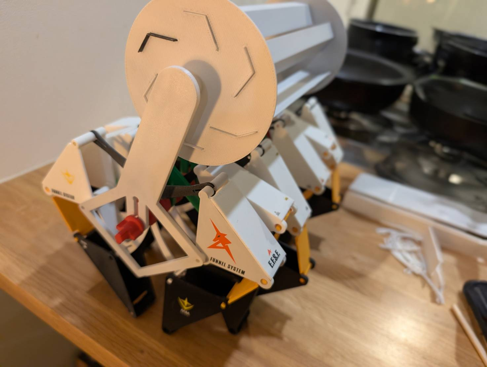 | 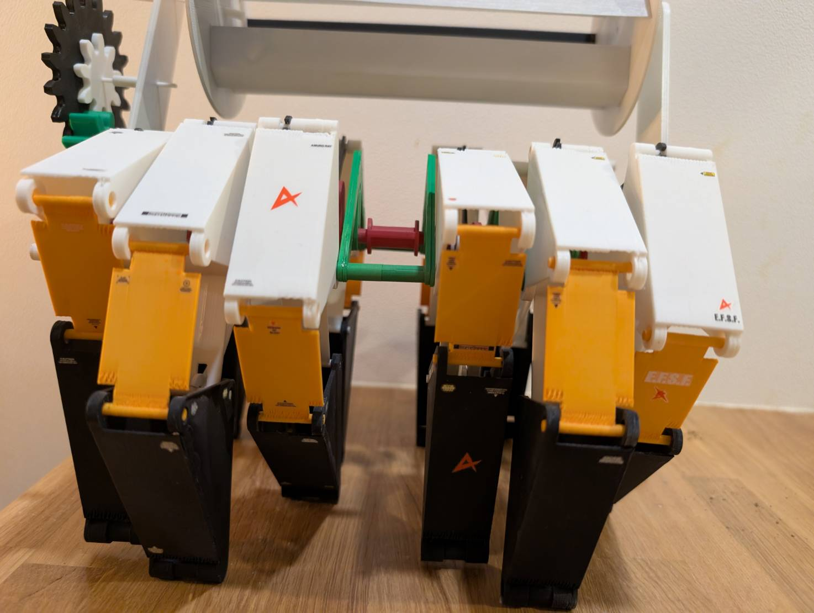 | 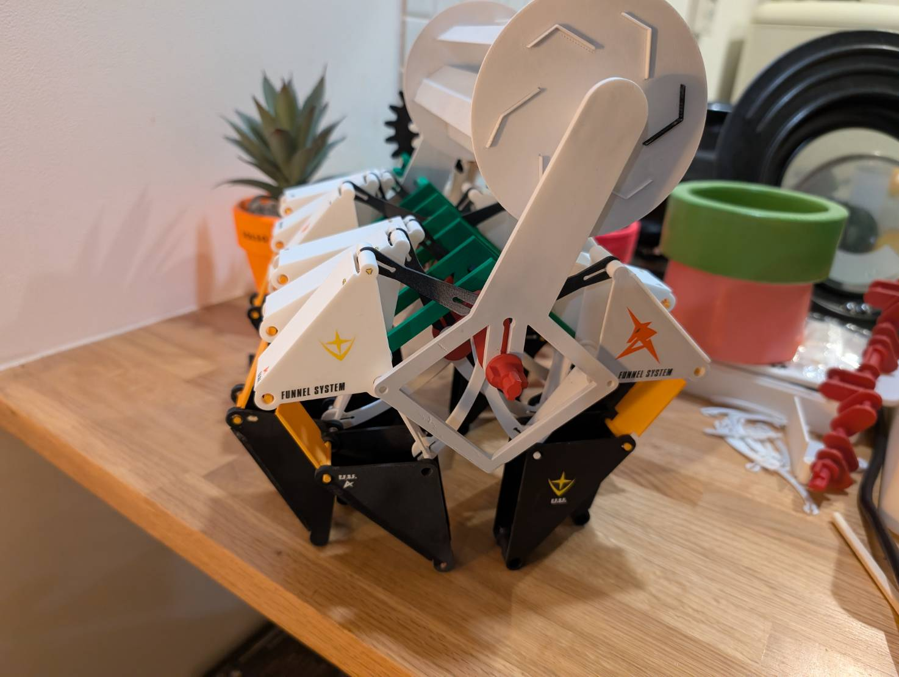 |

| 裏面ビュー | 反対側面ビュー | 逆斜めビュー |
|-------------|----------------|----------------|
|  | 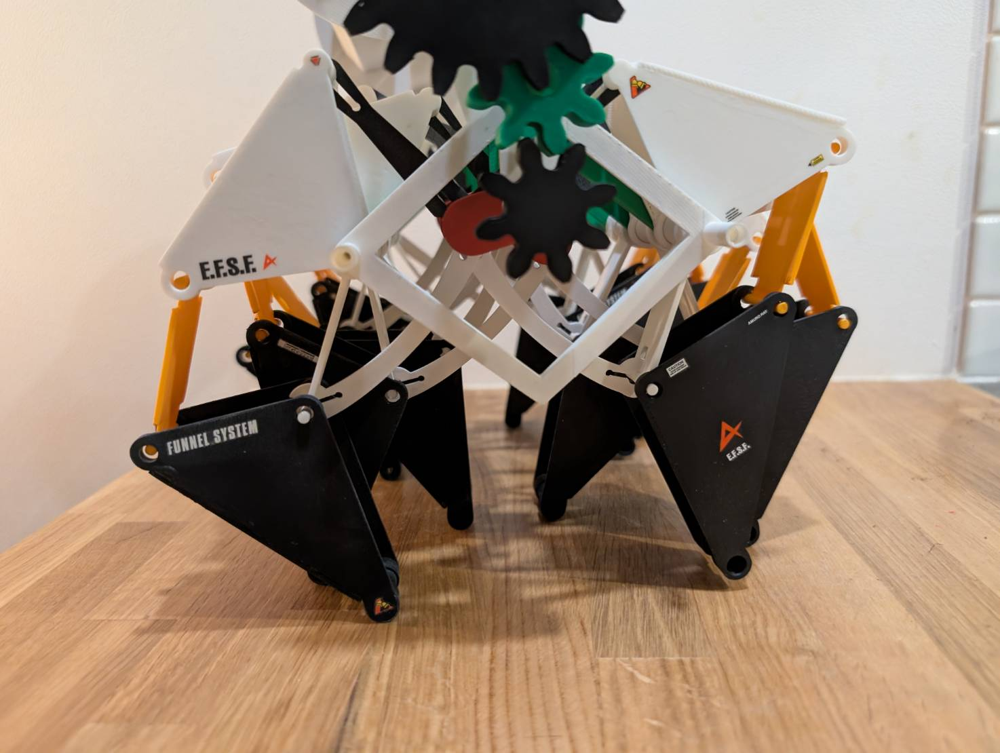 | 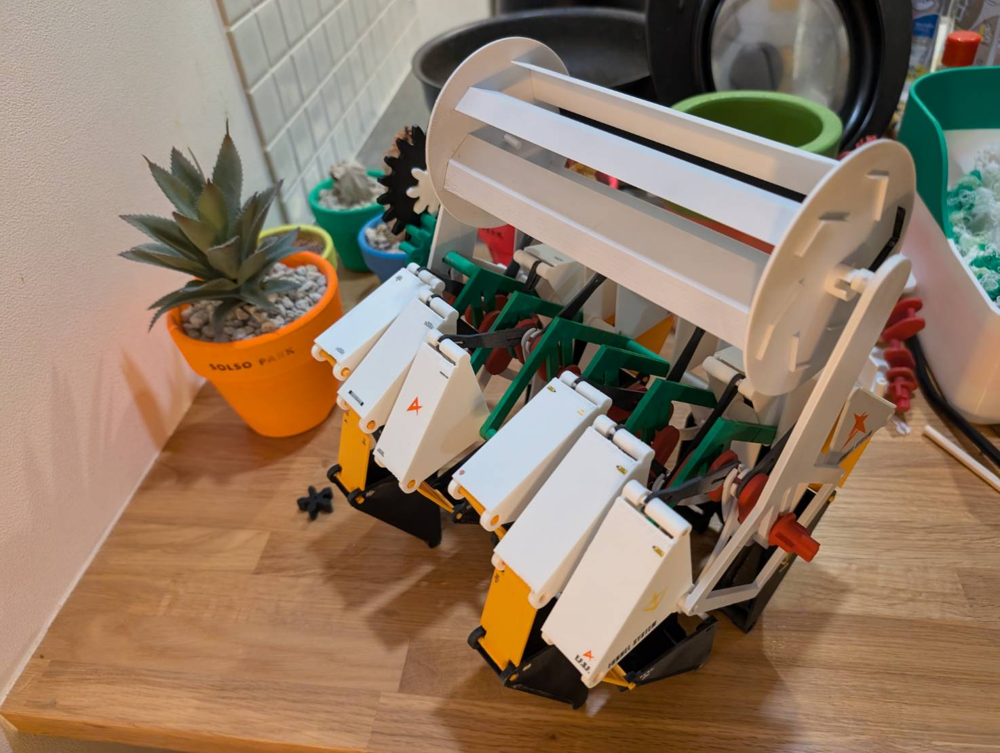 |

### ⚙️ 動作上の課題  

試作段階では、以下のような問題が発生しました：  
- 風力では風車がうまく回転しない。  
- 手動で回すと一部のパーツが外れてしまう。  
- 風車が安定せず、軸のブレが生じる。  

これらの課題は、後のVer.2で改良を重ねる重要なきっかけとなりました。

🎥 **テスト動画**  

---
## 9. Ver.1の再設計と構造改善

### ⚙️ Ver.1 が失敗した主な要因と改良に向けた考察

Ver.1の試作では、複数の課題が明らかになりました。  
ここでは、その要因とVer.2に向けた改良の方向性をまとめます。

---

1. **歯車設計の不備**
   
   クランクシャフトに対して**ギア比が小さすぎた**ため、風力では十分なトルクを得られず回転が不安定でした。
   
   改良にあたっては、自転車の変速機構を例に「力と速度の関係」を再考しました。
   たとえば、1速では小さな力で大きな歯車を回せますがスピードは遅く、
   6速ではスピードが出る代わりに大きな力が必要になります。

   この原理を踏まえ、小さな風力でも十分に動作するギア構成を目指して、
   トルク伝達に優れた大歯車＋小歯車の再設計を行いました。

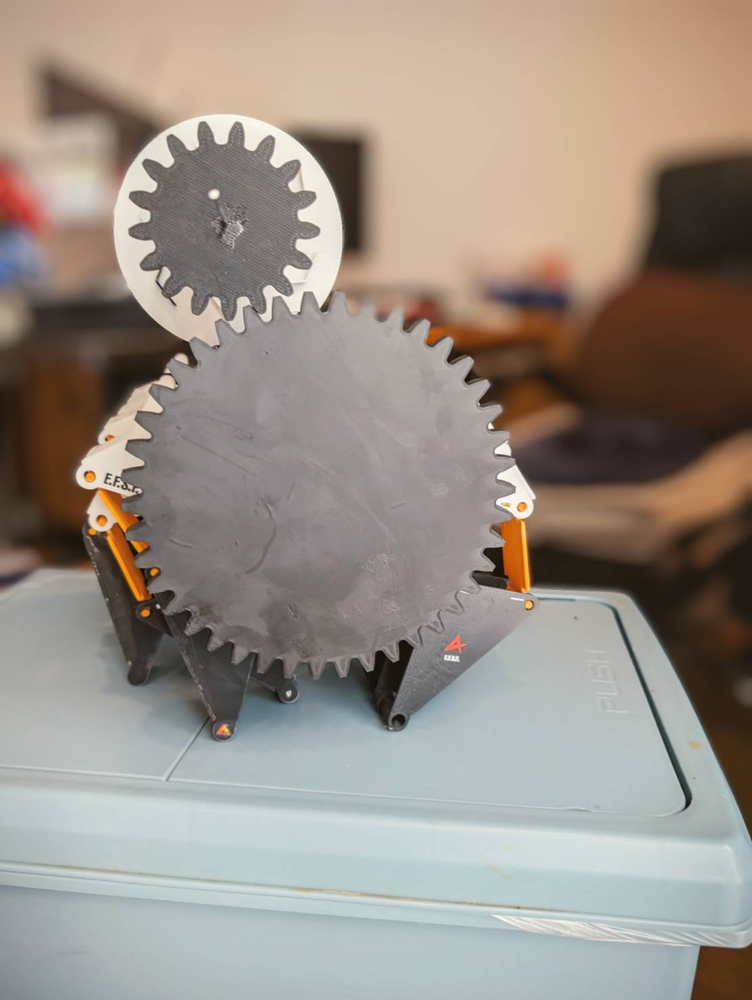

> 上の写真は、Ver.2開発に向けて行ったギア比検証の一例です。
一見単純な組み合わせに見えますが、小さな力をどのように伝達・増幅するかを検証する重要な実験でした。

  歯車は**組み合わせの自由度が高く、汎用性のある要素**であるため、  
  試行錯誤を重ねながら、Ver.2に向けて様々なパターンを検証しました。  

> 様々な試作を重ねるうちに、少しずつ歯車の奥深さがわかってきました。
その結果、気づけば部屋の中は歯車だらけになっていました。

2. **風車形状の非効率性**
   
   初期の**六枚羽型風車**では、風を十分に捉えられずトルクが不足していました。
   改良のきっかけは、**公園で偶然見つけた回転効率の良い風車**です。

    その観察から、風を“受け止める”だけでなく、
    **「どう逃がすか・どう調和させるか」**が重要であることに気づきました。

    この発見をもとに、風の流れを利用して効率的に回転する**サボニウス型風車**を採用しました。

   
   

3. **ステンレス棒の撓み問題**  
    ステンレス製の丸棒がしなって撓（たわ）みを生じ、
    その結果、軸の回転に不要な摩擦が発生していました。
    改良では、丸棒が常に水平を保てるように支持構造を再設計し、
    回転時のブレと摩擦ロスを軽減しました。

4. **クランクシャフトと部品を繋ぐフックがよく外れる**  
    脚部を駆動するフックが頻繁に外れてしまう問題がありました。
    原因は、力のベクトル（方向成分）を受け止める構造が存在しなかったため、
    駆動時にそのまま部品がすっぽ抜けてしまっていたことにあります。
    次の試作では、力の向きを考慮して受け止める支持構造を追加し、
    より安定した接続が維持できるよう改良しました。

---

## 10. Ver.2 の完成とレビュー  

### Ver.1とVer2の改良比較

これらの課題をすべて見直し、構造強度と動作の安定性を向上したと思われる。
以下はこれまでとの違いの比較である。

1. **Ver.1 と Ver.2 の歯車とステンレス棒支持の改良比較**

これまでの課題をすべて見直し、構造強度と動作の安定性を大幅に向上させました。  
以下の表では、Ver.1（初期設計）とVer.2（改良設計）の主要な違いを比較しています。

| 項目 | Ver.1（初期設計） | Ver.2（改良設計） |
|------|------------------|------------------|
| **正面ビュー** |  |  |
| **側面ビュー** |  |  |
| **ギア比** | ギア比が小さく、風力ではトルク不足。 | ギア比を再設計し、少ない風力でも安定して駆動可能に。 |
| **歯車精度** | 厚みやピッチが不均一で、噛み合わせに抵抗が発生。 | 歯形を修正し、スムーズな回転を実現。摩擦ロスを軽減。 |
| **構造安定性** | 軸支持が弱く、ステンレス棒が撓（たわ）み、摩擦が増加。 | 支持構造を延長・補強し、**ステンレス棒の撓み問題を解消**。|
| **クランク配置** | 力の伝達経路が非効率で、脚部の動きにムラ。 | 力の方向を考慮した配置に再設計し、スムーズな駆動を実現。 |
| **デザイン** | 試作要素が強く、構造が粗い印象。 | **メカニカルデザインと機能性の両立**を実現。 |

---

2. **六枚羽型風車**と**サボニウス型風車**の形状比較

  以下は、Ver.1（六枚羽型風車）とVer.2（サボニウス型風車）の形状比較です。  
  Ver.2では、風の受け方とトルク伝達効率を見直し、安定した回転を実現しました。

| 視点 | 左(Ver.1）・右（Ver.2） |
|------|----------------------------------|
| **正面ビュー** | 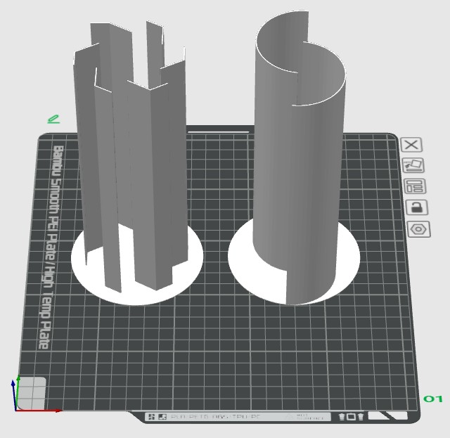 |  |
| **斜めビュー** | 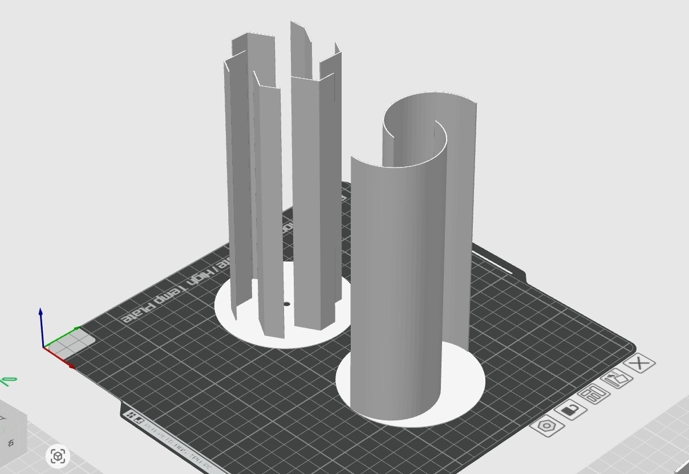 |  |
| **見下ろしビュー** | 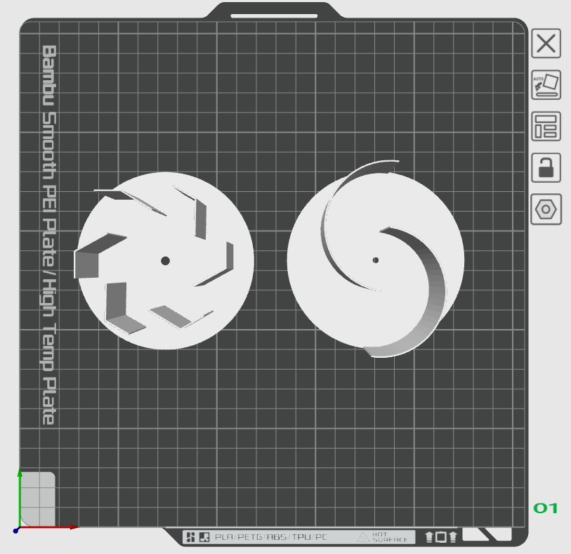 |  |

**実際の試作風車（左：六枚羽型／右：サボニウス型）**  

改良のポイント：なぜサボニウス型が優れているのか

| 観点 | 六枚羽型風車（Ver.1） | サボニウス型風車（Ver.2） |
|------|----------------------|----------------------|
| **風の受け方** | 風を正面から強く受け止める構造だが、背面で反発する力（抗力）が大きく、効率が低下。 | カップ形状により、風を受け流しながらも回転方向にトルクを集中させる構造。 |
| **トルク特性** | 風速が弱いと回転を始めにくく、初動トルクが不足。 | 抗力差（ドラッグ差）を利用して、弱い風でも回転を開始できる。 |
| **回転の安定性** | 羽根枚数が多く、風向変化でバランスを崩しやすい。 | 常に一方のカップが風を受け、もう一方が風を逃がすため、ブレが少なく安定。 |
| **製造・調整の容易さ** | 羽根の角度・形状の調整が難しく、トルク方向の最適化が困難。 | 構造が単純で、安定した動作を得やすい。 |
| **総合評価** | 見た目は軽快だが、実験では風の利用効率が低かった。 | トルク効率と安定性の両立を実現し、最終構造として採用。 |

---

3. **クランクシャフトと部品を繋ぐフックがよく外れる改良比較** 

  Ver.1 では、クランクシャフトと脚部を接続する**フック部品が頻繁に外れる**問題がありました。  
  原因は、力の**ベクトル（方向成分）を受け止める構造が存在しなかった**ためで、  
  回転方向の力がそのままフックの抜け方向へ働いていたことにあります。  

  Ver.2 では、**力を受け止める支持面**を新たに設け、  
  フックが外れにくくなるよう形状を再設計しました。  
  その結果、動作中の安定性が大幅に向上しました。  

| 視点 | 左（Ver.1）・右（Ver.2） |
|------|------------------------------|
| **フック構造（比較1）** |  |
| **フック構造（比較2）** | 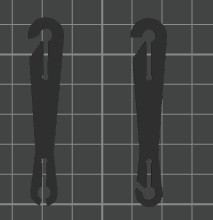 |

---
### Ver.2 完成時の外観  

| 斜めビュー | 正面ビュー | 側面ビュー |
|-------------|-------------|-------------|
| 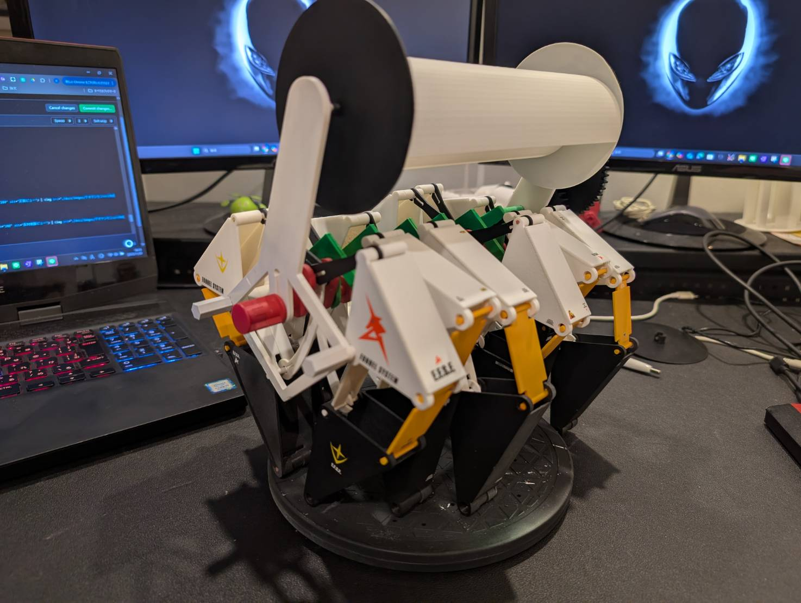 | 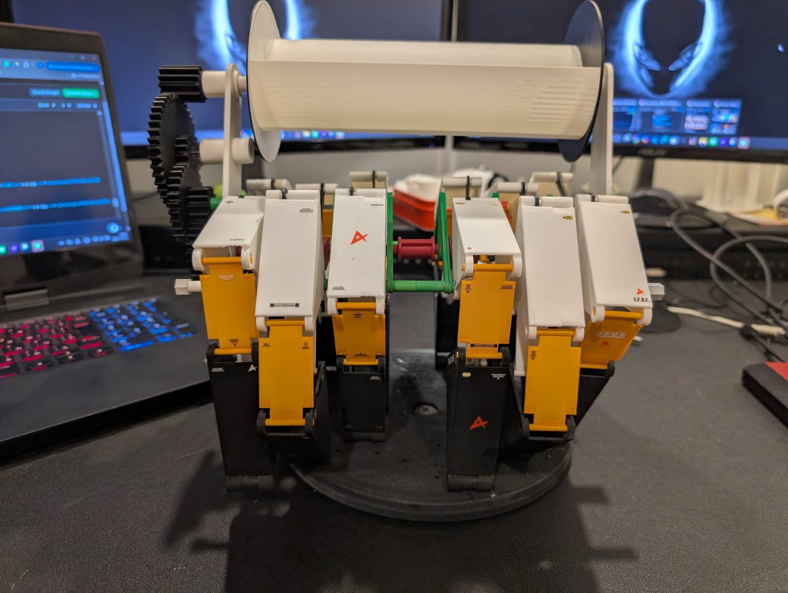 | 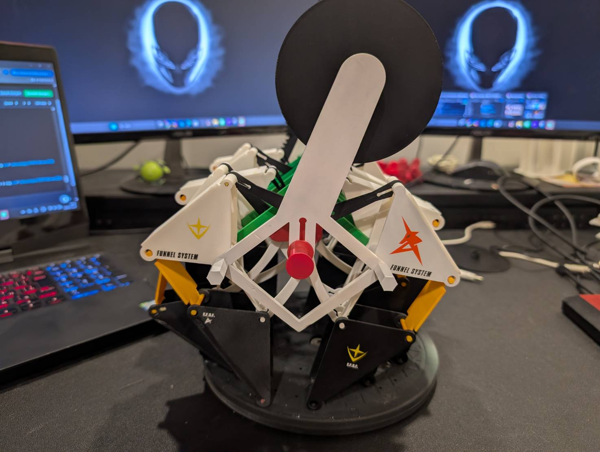 |

| 裏面ビュー | 反対側面ビュー | 逆斜めビュー |
|-------------|----------------|----------------|
| 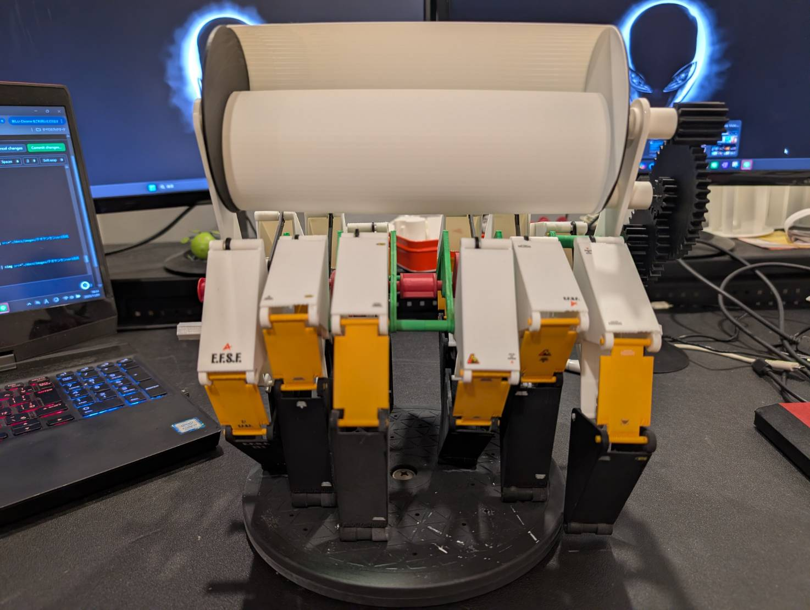 | 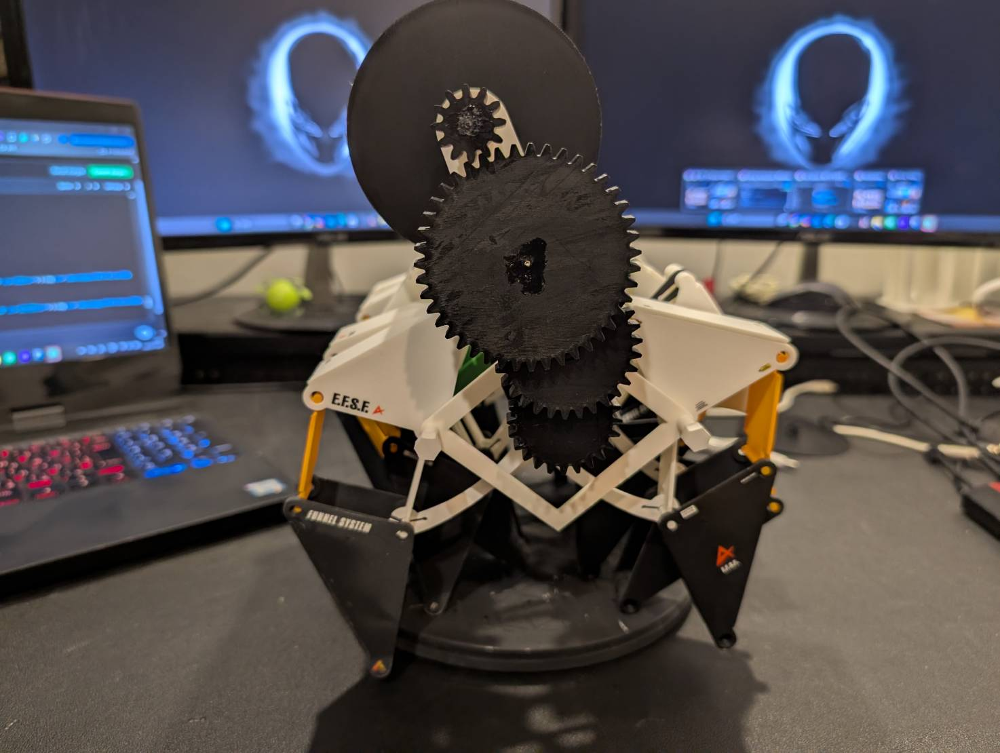 | 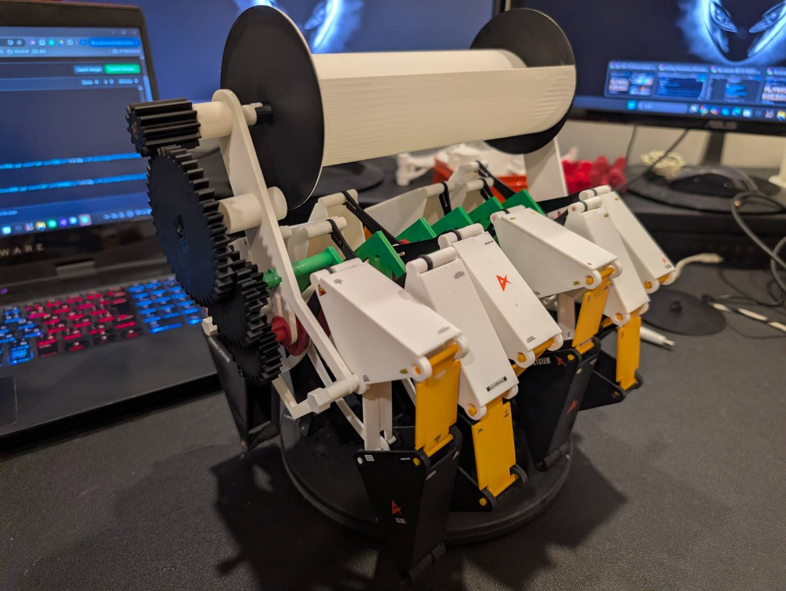 |

---
### Ver.2動作動画

以下が、**初めて実際に動作した瞬間**の映像です。  

🎥 **初動テスト動画**  

🎥 **紹介・再検証動画**  

 **まとめ**  
Ver.1 は「アイデアの具現化」に焦点を当てた初期モデルで、歯車設計やクランク配置に改善の余地がありました。  
Ver.2 では力学的バランスを再構築し、**風の力だけで自然に歩行するリノセウス**へと進化しています。  

---

## 🌬️ 今後の展望  

Ver.3ではさらなる「自然な歩行」を目指し、以下の改善を検討しています。  
ただ、今は少し休暇を取り、これまでの学びを整理する時間を取ろうと思っています。  

### 💡 改良構想  

- **Generative Design（GD）の導入**  
  Autodesk **Fusion 360** のジェネレーティブデザイン機能を活用し、  
  構造強度・軽量化・剛性バランスの最適化を検討しています。  
  この手法では、必要な箇所にのみ素材を残すことで、**最小重量で最大剛性**を実現できます。  

  下記は私が試しにやってみたものになります。
  

  🧠 **GD設計中の様子**  
  

  ⚙️ **Ver.2モデルとの比較（上：GD設計案／下：Ver.2）**  
  

  

  また近年では、いすゞ中央研究所によるジェネレーティブデザイン活用事例など、  
  実用レベルでの応用も進んでいます。 こういう取り組みなども参考に出来ればと思っております。 
   [Isuzu Central Research Laboratory × Generative Design（Autodesk公式ブログ）](https://www.autodesk.com/products/fusion-360/blog/ja/isuzu-central-research-laboratory-generative-design/)

---

- **回転軸の撓（たわ）みを抑制するための再設計**  
  Ver.2 では、ステンレス製の細い丸棒を回転軸として使用していましたが、  
  回転時に**撓み（たわみ）**が生じ、摩擦ロスや軸のブレが発生していました。  

  これは、材料の**ヤング率（E：Young’s Modulus）**に基づく**弾性変形**が原因です。  
  細く長い部材ほど、外力に対して変位量（たわみ量）が大きくなる傾向があります。  

  改良案としては以下のような対策を検討しています：  
  - **直径の大きい軽量中空シャフト材**（例：カーボンパイプやアルミ合金）の採用  
  - 軸中央部に**支持構造（サポートベアリング）**を追加し、たわみを分散  
  - 回転軸とギアの**同心度（コアアライメント）**を改善し、トルク伝達効率を向上  

  これらにより、**軸剛性（E×I）の増大**と**摩擦損失の低減**を実現し、  
  より安定した機構動作を目指します。  

---

- **CFD解析による風力エネルギーの可視化**  
  今後は、**CAE（Computer-Aided Engineering）**ツールを用いて、  
  風車翼からクランク機構へ伝わるエネルギー流れを  
  **CFD（数値流体解析）**でシミュレーションする計画です。  

  特に、風速・羽根角度・サボニウス形状による**渦流の発生と圧力分布**を解析し、  
  トルク発生メカニズムを**定量的に可視化**します。  
  これにより、**「風を逃がす設計」が安定した回転を生む理由**を物理的に検証することが可能となります。  

---

## 感想

このプロジェクトを通じて、私はテオ・ヤンセン氏の思想とエンジニアリングの融合を深く実感しました。
すべてを1から自分の手で作るのはとても難しい挑戦でしたが、ヤンセン氏はこれを0から創り出したのだと思うと、その偉大さを改めて感じました。

クランクシャフトやギアを自作する過程では、機械部品の構造の奥深さや汎用性の高さを実感し、機械工学の基礎を自分の手で体験できたように思います。
Ver.3 に向けた改良を通しても、ストランビーストを制作するという行為そのものが、あらゆる分野を学ぶきっかけになることを強く感じました。

また、風という自然エネルギーを利用して動くこの機構は、まさに機械工学とアートの交差点にある存在です。
機能と美しさ、設計と感性が融合したこの体験は、私にとって非常に刺激的で貴重な学びでした。

今後も、このプロジェクトを教育・展示・創作活動などを通じて広めていきたいと思います。
新しいアイデアや改良案があれば、ぜひ教えてください。

---
## 🧩 おまけ  

Fusion 360 で複数のコンポーネントを一括で **STL ファイル** に変換しようとした際、  
GUI 上ではその方法が見つからなかったため、**Fusion API** を利用して独自のアドオンボタンを作成しました。  

このコーディングは **GitHub Copilot** を使ってスムーズに実装しています。  
もしまだ使ったことがない方は、ぜひ一度試してみてください。  
Copilot を活用すると、開発スピードが向上するだけでなく、発想の幅も大きく広がります。 🚀  

🔗 [参考リポジトリ：Fusion360 Export All STL - Add-on Project](https://github.com/ktanino10/fusion360-export-all-stl/blob/main/README_ja.md)

📘 **English version:** [README.md](./README.md)

