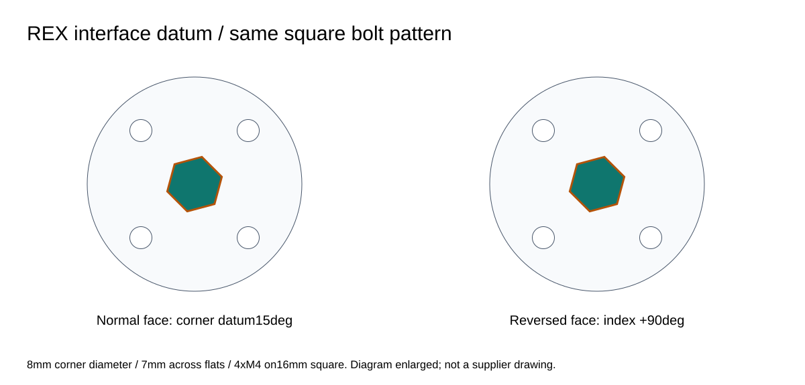
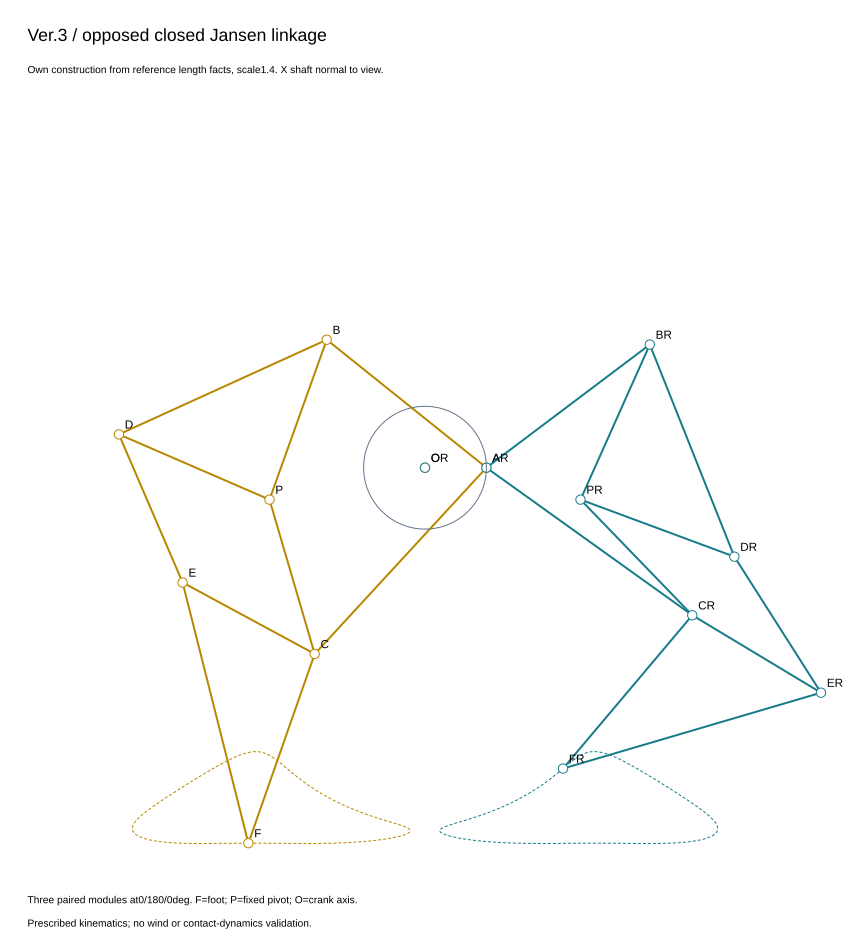
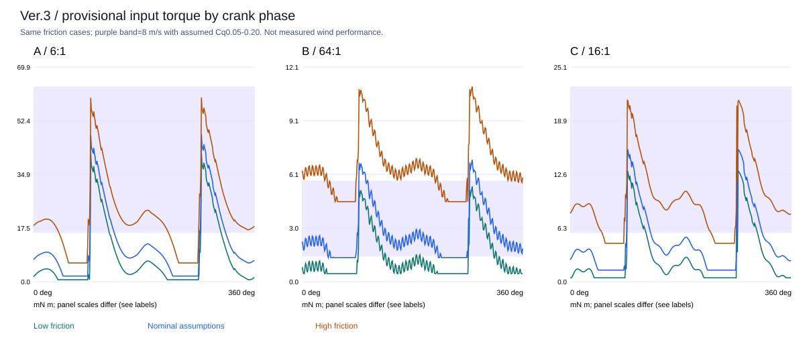

# Ver.3 — 設計・計算・生成設計ノート

**位置付け：実形状を伴う比較試作の第一カット。製造リリース、風力での自己始動、実機歩行、疲労寿命の確認ではありません。**

このパッケージは、FreeCAD の B-rep、STEP、印刷部品、部品表、同じ形状からの Blender 可視化と、再実行できる計算を含みます。動画は**規定入力と接地近似による運動学可視化**です。接触残差や小さい支持余裕を、部材の伸縮・任意の本体滑走・実験済みという表現で隠していません。

## 1. 何を直す設計か

| 項目 | 根拠の種類 | Ver.3 の対策 | 残る確認 |
|---|---|---|---|
| 風車・歯車と棒が滑り、一体で回らない | ユーザーが明確にした主故障 | 金属 REX 軸の平面と金属ハブの形状係合。樹脂歯車・クランク・風車板は実在する穴を通したボルトでハブへ結合 | 実購入ハブの締付仕様、実物の滑りトルク |
| 歯車が軸方向へ抜ける | 報告された懸念 | ハブ固定、軸端 M4 ボルトと座金、カラー、内輪専用スペーサ、外輪押さえ、脱着式ガード | 軸端タップ、端面接触、実物エンドプレイ |
| 支持部の摩擦・芯ずれ | 仮説。焼付きと断定しない | 転がり軸受、近接した支持、組立時の芯出し、各軸の位置決め側と逃がす側を区別 | 実際の始動抵抗、穴径・同軸度、印刷収縮 |
| 始動トルク不足 | 未測定。机上感度計算あり | 風車寸法と段数・減速比を三案で比較。関節静摩擦と各軸受の始動抵抗を別々に扱う | 風速・方位・風車角度別の静的トルク |
| クランク角で脚荷重が変わる | 正規リンクの全周計算 | 三つの対向脚モジュール、0/180/0°位相。接地支持・材料点残差を位相別に出力 | 地面、受動的な靴関節、フレームのたわみ、慣性 |

接着剤は主トルク経路にありません。カラーは**軸方向保持部品**であり、トルクキーではありません。

## 2. 三案の正式な比較範囲

| 案 | 風車外径 × 軸方向幅 | 伝達 | 狙い・代償 |
|---|---|---|---|
| **A：大風車・少段減速** | 300 × 180 mm | 購入 HTD5M 歯付きベルト 24:48 と平歯車 29:87、総減速 **6:1** | 入力面積を増やす。ベルト張力調整、風荷重、転倒、分割風車の組立が増える |
| **B：小風車・高減速** | 90 × 180 mm | 平歯車 21:84 を三段、**64:1** | 小風車を維持する代わりに低速化。段数・軸受・始動抵抗・部品数が増える。減速しても入力電力は増えない |
| **C：中間風車・生成軽量** | 180 × 180 mm | 平歯車 21:84 を二段、**16:1** | 中間寸法・段数。保存領域を守ったリブ幅・厚さ・配置のパラメトリック生成設計 |

平歯車はすべてモジュール 2、圧力角 20°、歯幅 8 mm。A の一次段は**歯車ではなく歯付きベルト**です。旧単段案や全段を片側へ集めた案は採用図に混ぜていません。

全ソリッド体積と仮定密度・購入品質量による比較値は [comparison.csv](comparison.csv) と各 [CAD 集計 A](cad_validation_A.json) / [B](cad_validation_B.json) / [C](cad_validation_C.json) を参照してください。これはスライサーで確認した印刷質量ではありません。中空率による減量を、そのまま剛性が変わらない減量と解釈してはいけません。

一方へ集めた歯車箱の重心偏りは、巨大な靴や任意バラストで隠さず、**段を左右端へ配分する配置**で対処しました。B は足三角形の軸方向レイヤー位置も調整しています。リンクのピン間長さは変えていません。

## 3. 既存資料との対応

測定対象はリポジトリ内の未拡大 STL と図面です。[legacy_measurements.csv](legacy_measurements.csv) にファイル座標の外接寸法を保存しています。STL 自体に単位情報はないため、既存資料に沿って mm と解釈しました。

代表値は、Ver.2 の風車が約 90 mm 径・180.692 mm 幅、`gear.stl` が約 67.44 × 67.48 × 23 mm、`Crankshaft_Part1.stl` が約 40.70 × 97.31 × 37.39 mm。これは**ファイルの外接寸法**であり、現物測定、歯数、軸穴の保証値ではありません。PDF の形状・寸法・部品表も参照しましたが、完全な Ver.2 パラメトリックモデルはありません。

既存 README の 150% / 脚 160% は過去の製作設定です。**Ver.3 の STL は実寸 mm、100%**。再び 150% に拡大しません。新しいリンク・軸受・ハブ規格の設計なので、Ver.2 への無加工の差替え互換性はありません。

## 4. 正のトルク伝達と軸方向保持

### 購入インターフェース

- goBILDA **1309-0016-4008 Sonic Hub**：8 mm REX 用、7 mm 対辺、外径 32 mm、本体 8 mm、直径 14 mm × 2 mm のパイロット、16 mm 正方形上の四つの M4 穴、カタログ質量 14 g。
- 8 mm REX は「8 mm 六角」ではありません。**7 mm 対辺の六角の頂点を直径 8 mm に仕上げた断面**です。CAD の軸もその交差断面で、丸棒に名前だけ付け替えていません。
- 対辺と取付穴の**相対角**も購入品に合わせています。ハブ局所面の穴中心角が45/135/225/315°のとき、対辺法線は45°から60°刻み、軸の角部基準は15°です。向かい合う反転ハブは90°インデックスして同じ軸へ合わせます。四角の取付穴とクランク0/180/0°は変えません。独立レビューのメーカー公開CAD照合で見つかった初稿の15°ずれを修正したものです。
- ハブの係合平面、軸の平面、パイロット、歯車・クランクの取付穴、締結ねじと軸端止めを CAD に設けています。
- 608 呼びの軸受は 8 × 22 × 7 mm とし、内部の玉・保持器・ねじ山・市販ハブの特殊な弾性部は簡略表示です。購入品は印刷 STL に含めません。

標準寸法とメーカーの公開図を根拠にした**購入部品の寸法モデル**です。メーカー CAD や図面画像の再配布ではありません。仕入先在庫、輸送、実物寸法公差、材料等級、締付トルクは発注前確認事項です。



### 荷重経路

風車カップ → ねじ止めフォーク／端板 → 四本の M4 → 金属ハブ → REX 平面 → 伝達段 → 金属ハブ → クランク板 → 両持ち M4 ピン → 脚。

クランクは一本の貫通主軸ではありません。AB・AC 棒が主軸中心 O を横切るため、貫通軸を置くと全周の途中で衝突します。**三つの開いたクランク区間、二枚の頬板、20 mm のピン間隙、区間ごとの REX 軸**を実形状で採用しました。

M4 軸端止めはワッシャを介して凹部に収め、棒が通る隙間へ頭を突出させません。頬板のハブ用ねじは皿頭を面一にしています。

位置決め軸受の内輪はカラー／ハブと **8.1 mm ID × 10 mm OD** のスペーサで扱い、シールド・外輪を一緒に挟みません。外輪は 20.2 mm 開口の肩と押さえで保持します。位置決め外輪ポケットは 7.2 mm、逃がす側は 7.7 mm。内輪の名目すきま 0.2 mm と合わせ、実物ではシムと測定で決め直します。複数軸受を端から端まで締め上げて予圧を作らないでください。

## 5. A の歯付きベルトは「無損失の線」ではない

購入指定は次の組合せです。

| 部品 | 確認した規格 |
|---|---|
| 3411-0014-0024 | 24T、HTD5M、14 mm 穴、12 mm 幅、9.25 mm ベルト溝、アルミ、23 g |
| 3415-0014-0048 | 48T、HTD5M、14 mm 穴、12 mm 幅、9.3 mm ベルト溝、樹脂、42 g |
| 3412-0009-0520 | HTD5M、104歯、520 mm ピッチ長、9 mm 幅、ネオプレン／ガラス繊維 |

24T プーリーにはねじ穴と通し穴の両方があります。**ハブと二重ねじにせず、角度を合わせた通し穴・7.2 mm 径 × 4 mm 深さの座ぐりを使用**します。48T 側は指定の通し穴を使います。

ピッチ半径を小径側 $r$、大径側 $R$、中心距離を $C$ とした開ベルトの式を解いています。

$$
L=2\sqrt{C^2-(R-r)^2}+\pi(R+r)+2(R-r)\arcsin\frac{R-r}{C}
$$

520 mm のピッチ長に合う中心距離と小径巻付きは [selected_designs.json](selected_designs.json) に数値を保存しています。小径側の係合は 8 歯以上という**本設計の基準**で確認しました。実際には長さ公差と伸びがあるので、三つの入力軸受キャリッジを同じ芯出し棒で揃え、**実在する ±1.5 mm の長穴**で張力を調整します。中間軸と平歯車中心は動かしません。

各スパンの初期張力 10 N は仮定です。約 20 N のラジアル荷重を無視せず、フレーム側の共通軸荷重仮定 30 N に含めています。始動抵抗は軸受ごとに感度計算し、ベルトの効率仮定 0.95 も明記します。締め過ぎで低摩擦になるわけではありません。

購入プーリーとベルトの歯形は**クリアランス／表示用包絡形状**です。これを HTD 歯形の製作図や印刷用データとして使わず、指定の互換購入品を使ってください。

## 6. 平歯車と回転方向

インボリュート歯面を数式から作り、根元はラジアル接続で閉じています。歯底のホブ加工トロコイドや歯元疲労解析を再現したものではありません。歯先・歯底の逃げ、取付穴から歯底までの肉、接触比、無転位干渉、全かみ合い周期を計算します。

- 圧力角 20°、無転位。KHK の標準的なアンダーカット限界の説明を参照し、入力歯数は 21 以上としました。
- 合計円周バックラッシの名目値は **0.30 mm**。両歯車から各 0.15 mm を減らしています。これはプリンター固有の保証値ではなく、フィット試験の出発点です。
- かみ合い率 1.4 以上、歯先厚 0.8 mm 以上、取付穴から歯底まで 4.5 mm 以上は本設計の選別基準です。
- A の開ベルトは同方向、平歯車一段は反転。B の三つの平歯車は合計反転、C の二段は合計同方向。正規データの符号と風車のカップ向きを合わせています。
- クランク回転を正として、入力速度比は **A −6、B −64、C +16**。中間軸の比も [validation_A.json](validation_A.json) / [B](validation_B.json) / [C](validation_C.json) に出力します。

## 7. 正規リンクと前進シーン

参考にした寸法は [Frido Verweij の Jansen 機構解説](https://library.fridoverweij.com/codelab/strandbeest/index.html) の長さという事実情報です。コードや図版はコピーせず、円の交点式と図を新規に実装しました。

| 区間 | 参考長さ | 区間 | 参考長さ |
|---|---:|---|---:|
| QP / OQ | 38 / 7.8 | OA | 15 |
| AB / BP | 50 / 41.5 | AC / PC | 61.9 / 39.3 |
| BD / PD | 55.8 / 40.1 | CE / DE | 36.7 / 39.4 |
| CF / EF | 49 / 65.7 | 拡大係数 | 1.4 |

O と P が固定側、A がクランクピン、F が足です。PBD と CEF は剛体三角形。OA は 21 mm になり、直径 32 mm の金属ハブとピン頭・工具のための空間を確保します。左右は正しく鏡映した閉リンクで、単に棒を往復させていません。



脚長の閉路、足軌跡、重なった軸方向レイヤー、固定棒・補助軸・レールとの隙間を全周で確認します。最小に近い AC と固定軸スペーサの隙間は数値最小化も行います。CAD 上の小さい隙間を、印刷後にも確実に残る隙間と解釈しないでください。

### 歩行可視化の定義

本体の前進は接地靴の CAD 頂点、支持多角形、持続する材料点アンカーから求めます。全身に剛体変換をかけ、**任意速度を足しただけの滑走やリンクの伸縮はしません**。入力風車は共通の規定値 120 rpm。

| 案 | 3クランク周期の実時間 | 動画での時間 |
|---|---:|---:|
| A | 9秒 | 9秒、1× |
| B | 96秒 | 12秒、8× |
| C | 24秒 | 12秒、2× |

これは同じ風速で各風車が 120 rpm になるという主張ではありません。速度比較のための**同じ規定入力**です。別途、風速と仮定周速比による比較も計算値として区別します。

[walk_A.json](walk_A.json) / [B](walk_B.json) / [C](walk_C.json) には、前進量、接地隙間、CAD 頂点による地面貫通検査、支持余裕、負荷を持つ接地区間ごとの材料点残差を保存します。

主表の「滑り指標」は、計算上の総荷重の **2%以上**を受け持つ一つの継続区間で、材料点が着地／動画開始時のアンカーからどれだけ水平にずれたかの最大値です。動画開始時点ですでに接触していた**部分区間も含み、そのフラグを保存**します。「水平経路長」は同じ区間での移動距離の累積で、別の量です。全三周期の合計値とも混同しません。比率を出す場合は、**同じ区間の本体前進量**を併記し、一周期全体の距離を分母にしません。

| 同一定義の最終指標 | A | B | C |
|---|---:|---:|---:|
| 荷重区間内の最大アンカー残差（開始部分区間を含む） | 9.55 mm | 10.30 mm | 8.88 mm |
| 完全に含まれる荷重区間だけでの最大残差 | 7.18 mm | 6.99 mm | 5.89 mm |
| 荷重しきい値を使わない、全近接足の材料点監査（動画フレーム標本） | 8.90 mm | 8.54 mm | 7.56 mm |
| 同監査で完全に含まれる区間の最大残差 | 7.16 mm | 7.03 mm | 7.35 mm |

[全近接足監査 A](contact_review_A.json) / [B](contact_review_B.json) / [C](contact_review_C.json) は、荷重の大小で足を除外せず、実際の動画フレームで材料点を追います。材料点の水平移動は靴の揺動も含み、実測されたクーロン摩擦の滑り量ではありません。二つの監査は基準点・標本間隔が異なり、数値を混ぜて改善と解釈しません。

幾何上の近接足は全動画標本で 3 本以上ですが、荷重配分モデルの 2% しきい値以上となる足は切替部で A/B は 2 本、C は 1 本になる瞬間があります。**常に実用的な三脚荷重支持が成立したという意味ではありません。** 近接判定 0.25 mm と地面からの表示上のオフセット 0.02 mm を区別し、全近接足の絶対隙間は最大約 0.269 mm です。

3 mm は設計側の厳しい目標です。未達を合格に言い換えず、そのまま報告します。0.25 mm の近接接地許容差、剛体部材、靴ヒンジの規定姿勢、仮定質量による近似であり、地面の接触動力学・慣性・衝撃・実摩擦を解いた動画ではありません。

**正の支持余裕が 0.1 mm 程度あっても「実用上安定」ではありません。** 印刷・組付け・重心の不確かさを十分に覆いません。重心 ±5 mm と風による転倒モーメントの感度は、名目姿勢を固定した診断として扱い、実機の転倒耐性を保証しません。

## 8. トルク、風、始動抵抗

全案で同じ風速 3 / 5 / 8 m/s、同じ仮定トルク係数範囲 0.05–0.20、同じ摩擦条件を使います。

$$
T_\mathrm{wind}=\tfrac12\rho (2RL)\,R\,C_Q\,v^2
$$

密度は 1.225 kg/m³、$R$ は風車半径、$L$ は軸方向幅です。**静的トルク係数は未測定**で、実際には不利な方位・風車角でゼロや負になることもあります。正の係数を置いた表だけで全角度自己始動を保証できません。

静摩擦係数 0.05 / 0.10 / 0.18、軸受一個の始動トルク 0.1 / 0.3 / 1 Nmm、地面抵抗の仮定係数 0.005 / 0.015 / 0.03 を比較します。各リンクの力・モーメント釣合いから関節反力を計算し、ジャーナル半径と相対角速度比を使います。**始動摩擦を伝達効率の定数一つに押し込めていません。**

ベルトは効率 0.95、平歯車は一段 0.90 が名目仮定。各軸の軸受抵抗は、その軸までの比率と仮定効率を通して入力軸に換算します。軸受数が増える B に有利な摩擦だけを選びません。

位相別値と条件は [startup_A.json](startup_A.json) / [B](startup_B.json) / [C](startup_C.json)、[比較集計](comparison.csv) を参照してください。利用可能な入力と要求入力の両方を示します。始動できない位相を、回転中なら慣性で越えられると勝手に扱いません。慣性・風の脈動・回転継続の実証は未実施です。



接地荷重は規定歩行の第二周期から、全案共通の 1°間隔で採っています。全装置の非負荷重配分は、自由な靴ヒンジを含む全内部機構の静的・動的実現を証明するものではありません。脚の局所釣合いはその荷重条件付きです。AC の単純なピン支持 Euler 座屈スクリーニング比も約 1.56–1.94 に留まり、印刷公差・積層・疲労を含む強度余裕とは扱いません。

## 9. 実行した Generative Design の範囲

呼称は **パラメトリック生成設計**です。Autodesk Generative Design、CFD、ソリッド FEA、トポロジー最適化を実行したとは称しません。

1. 風車寸法・段の構成という承認範囲内で、歯数、軸位置、支持配置、左右の段配置を探索。
2. 軸受・固定軸・ボルト座の保存領域、回転体と脚の全可動域、他の貫通軸、工具／装着のための領域、256 mm 印刷枠を制約化。
3. Delaunay 接続を基にリブを作り、長い区間は実際に連結された節点・リブで細分化。単に計算上だけ分割しません。
4. 共通の仮定軸荷重 30 N、固定ピボット 10 N、ヤング率 1700 MPa、許容応力 10 MPa を使用。
5. 平面内の線形軸力ネットワークと、最長自由リブへの面外 1 N の片持ち梁近似を計算。平面内変位 0.3 mm、面外近似 0.8 mm を選別基準にする。
6. C は宣言した幅・厚さグリッドで体積代理量を最小化。重なったリブ・ボスの代理量と、生成後の CAD 実体積は区別する。

境界・採用値：[design.json](../../scripts/ver3/design.json)、[selected_designs.json](selected_designs.json)。候補記録：[gear_search.csv](gear_search.csv)、[構造探索 A](structure_search_A.json) / [B](structure_search_B.json) / [C](structure_search_C.json)。

同じ C の軸位置・保存領域・荷重を用いた探索内比較は次のとおりです。

| C の構造候補 | 厚さ × リブ幅 | 部材加算体積の代理量 | 平面内変位の代理計算 | 面外変位の代理計算 |
|---|---:|---:|---:|---:|
| 太いリブの基準候補 | 8 × 14 mm | 1,101,318 mm³ | 0.02198 mm | 0.38717 mm |
| 採用された生成候補 | 8 × 8 mm | 713,124 mm³ | 0.03846 mm | 0.67754 mm |

体積代理量は約35.25%減りましたが、変位の代理値は増えています。両変位は宣言した選別限界内であっても、実物の剛性を確認した意味ではありません。リブ・ボスの重複を含む**加算代理量**であり、CAD実体積や装置全体の質量が35.25%減ったという主張ではありません。

局所のねじ座・薄肉・軸受リング・印刷積層・脚関節の曲げ・疲労を十分に表すソリッド解析ではありません。フレームだけの体積削減を装置全体の効率向上と混同しません。

## 10. ファイルと再生成

| 内容 | 場所 |
|---|---|
| 寸法・材料・仮定の設定 | [scripts/ver3/design.json](../../scripts/ver3/design.json) |
| 閉リンク・速度・正規変換 | [core.py](../../scripts/ver3/core.py) |
| 制約付き探索 | [system_search.py](../../scripts/ver3/system_search.py) |
| FreeCAD 生成 | [build_cad.py](../../scripts/ver3/build_cad.py)、[cad_parts.py](../../scripts/ver3/cad_parts.py) |
| ネイティブ・STEP・可視化用同一メッシュ | [FreeCAD/Ver.3](../../FreeCAD/Ver.3) |
| 印刷対象のみ | [STL/Ver.3](../../STL/Ver.3) |
| 購入／切断品を含む部品表 | [A](BOM_A.csv)、[B](BOM_B.csv)、[C](BOM_C.csv) |
| 実断面・カバー型紙 | [drawings](drawings) |
| 実行結果・比較 | [comparison.csv](comparison.csv)、`validation_*.json`、`intersections_*.json` |
| 組立とベンチ確認 | [ASSEMBLY_ja.md](ASSEMBLY_ja.md) |
| 独立レビュー | [REVIEW_ja.md](REVIEW_ja.md) |

FCStd は名前と仕様を持つネイティブ Part フィーチャです。形状変更の正規経路は設定・生成スクリプトの編集と再生成で、任意の文字プロパティを変えただけで形が追従する Sketcher 履歴とは異なります。

既存 FreeCAD / Blender を使用してください。この作業では新しい大規模アプリの導入、購入、プリンター操作をしていません。

```bash
# リポジトリのルートから。通常の Python 環境には requirements.txt の依存が必要。
python3 scripts/ver3/system_search.py

# macOS の既存 FreeCAD アプリの例。環境に応じて二つのパスを変更。
FC_PY=/Applications/FreeCAD.app/Contents/Resources/bin/python
FC_LIB=/Applications/FreeCAD.app/Contents/Resources/lib
"$FC_PY" scripts/ver3/build_cad.py --freecad-lib "$FC_LIB"
"$FC_PY" scripts/ver3/check_cad.py --freecad-lib "$FC_LIB" --only A
"$FC_PY" scripts/ver3/check_cad.py --freecad-lib "$FC_LIB" --only B
"$FC_PY" scripts/ver3/check_cad.py --freecad-lib "$FC_LIB" --only C
python3 scripts/ver3/validate.py
python3 scripts/ver3/walking.py
python3 scripts/ver3/contact_report.py
python3 scripts/ver3/startup.py --only A
python3 scripts/ver3/startup.py --only B
python3 scripts/ver3/startup.py --only C
"$FC_PY" scripts/ver3/drawings.py --freecad-lib "$FC_LIB"
python3 scripts/ver3/reports.py
"$FC_PY" scripts/ver3/access_checks.py --freecad-lib "$FC_LIB"

# Blender は別のヘッドレスプロセスで実行。既存のユーザーシーンを操作しない。
# ffmpeg / ffprobe も PATH に必要。生フレームはリポジトリ外の一時領域へ。
blender --background --threads 4 --python scripts/ver3/render_blender.py -- \
  --profile system --phase all

# 再レンダリングせず、保存済みネイティブとソース・動画を照合する場合
blender --background --threads 4 --python scripts/ver3/render_blender.py -- \
  --profile system --phase validate
```

歩行 JSON は CAD / メッシュ / core のハッシュを持ちます。CAD 変更後は歩行・動画も再生成し、古い画像を新しい設計の証拠に使わないでください。

`render_blender.py` の旧 `first-cut` プロファイルは過去実験用で、現行パッケージの生成には使用しません。現行の出力先は `--profile system` の `Blender/Ver.3/ver3_ABC.blend` と `docs/ver3/media/` です。`.blend` は規定歩行・歯車軸の回転をベイク済みで、閲覧時の自動 Python 実行許可は不要です。B の 8倍動画は入力が一動画コマに −240°回るため、正しくアンラップした回転でも 24 fps 表示上のストロボが起こり得ます。

ガード／窓の仕様は各段の `guard_depth`、`window_aperture_mm`、`window_screw_length_mm` から生成します。A のベルト段は35 mm深さ・窓軸穴13 mm・M3×40、平歯車段は31 mm・10 mm・M3×35です。前側キャリアが一部の窓ねじへの直線工具経路を隠すため、手順はキャリア先行の取外し／キャリア後付けの組立です。[装着経路確認](assembly_access_A.json) には必要な部分組立状態も記録しています。

A 窓の四つの追加孔は `carriage_screw_window_points` と `carriage_screw_window_bore_mm` による **直径8.4 mm・36 mm正方形**です。キャリッジ固定 M4ねじの直径4 mm、調整移動±1.5 mm、残る半径方向余裕0.7 mmを含みます。窓ねじ用の3.3 mm孔や回転軸用の13 mm孔とは別です。窓を残したままキャリアユニットを外せるかも、調整端を含めて確認します。

## 11. 公開根拠と確認待ち

- [KHK — Involute gear profile](https://khkgears.net/new/gear_knowledge/gear_technical_reference/involute_gear_profile.html)
- [KHK — Gear dimensions](https://khkgears.net/new/gear_knowledge/gear_technical_reference/calculation_gear_dimensions.html)
- [goBILDA Sonic Hub](https://www.gobilda.com/1309-series-sonic-hub-8mm-rex-bore/)
- [goBILDA REX shafting](https://www.gobilda.com/stainless-steel-rex-shafting/)
- [24T HTD5M pulley](https://www.gobilda.com/3411-series-5mm-htd-pitch-aluminum-hub-mount-timing-belt-pulley-14mm-bore-24-tooth/)
- [48T HTD5M pulley](https://www.gobilda.com/3415-series-5mm-htd-pitch-hub-mount-timing-belt-pulley-14mm-bore-48-tooth/)
- [HTD5M belt specifications](https://www.gobilda.com/5mm-htd-timing-belts/)
- [Jansen dimensional reference](https://library.fridoverweij.com/codelab/strandbeest/index.html)
- [Autodesk — preserve geometry](https://help.autodesk.com/cloudhelp/ENU/Fusion-GenerativeDesign/files/GD-PRESERVE-GEOM.htm)
- [Autodesk — obstacle geometry, including tools and motion](https://help.autodesk.com/cloudhelp/ENU/Fusion-GenerativeDesign/files/GD-OBSTACLE-GEOM.htm)

次の実測が必要です：実機のクランク角別負荷、各ジャーナル／軸受の始動抵抗、風速・方位・ローター角別の静的トルク、実際の印刷質量と重心、軸端保持、歩行時の滑りと転倒。ここにない実験結果を推定値で埋めていません。
