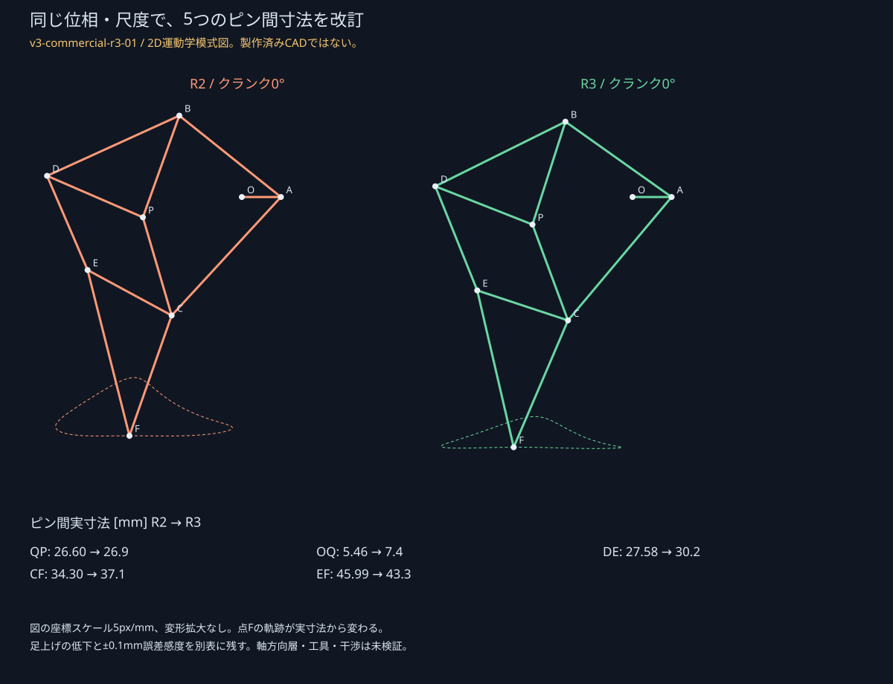
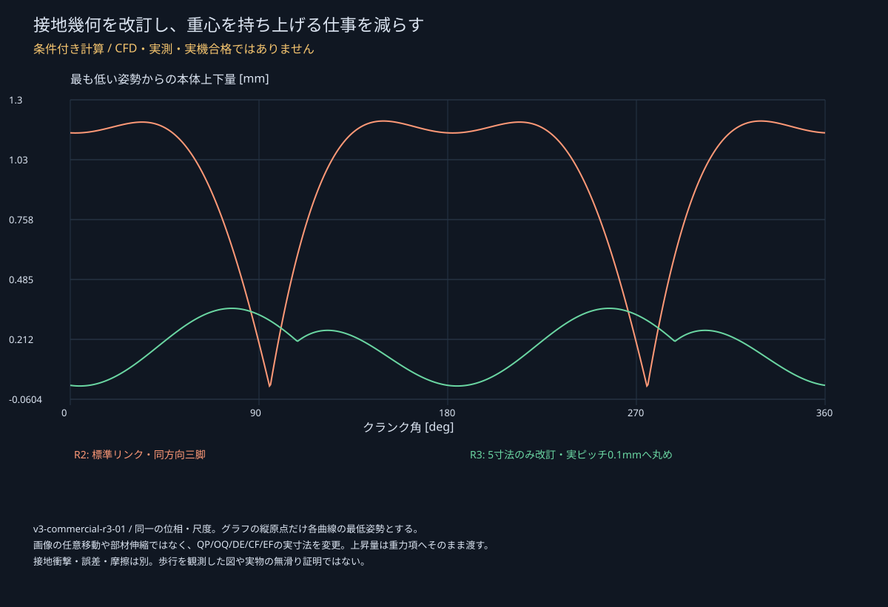
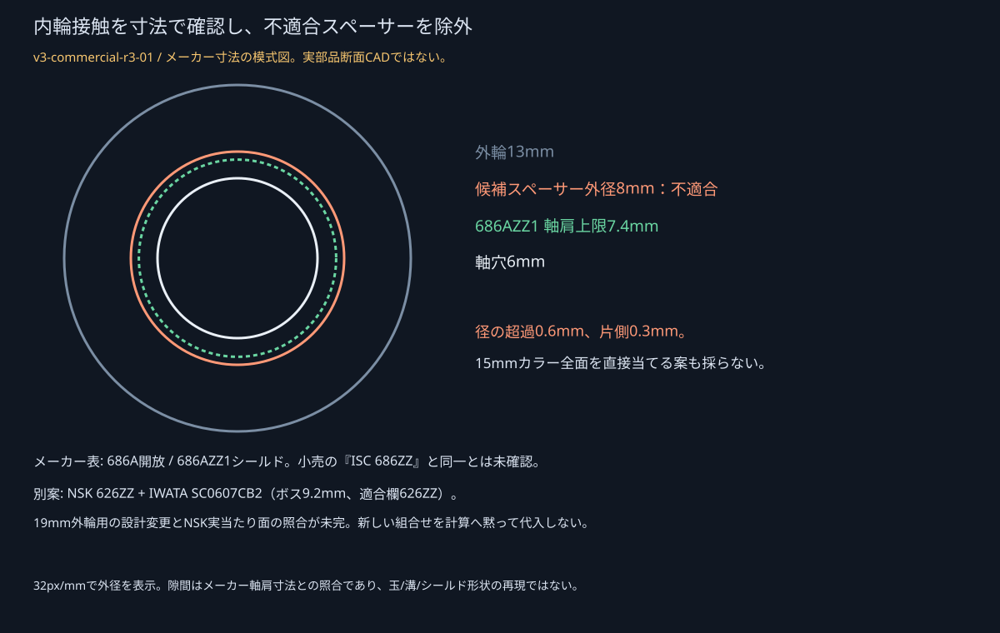

# 共通市販ドライヤー基準による限定再設計

**`v3-commercial-r3-01`／新しい製造版CADではありません。合格した完成試作は0案です。**

ユーザーの「市販のドライヤー基準でよい」を受け、ReFaの型番・写真・風速計・現物測定を**設計再開の前提から外しました**。旧 [`v3-r2-feasibility-02`](../feasibility_r2/GATE_ja.md) は変更せず、新しい共通条件で寸法・負荷・同期・調達を進めた結果です。実測待ちを理由に計算を止めたものではなく、以下の**固定したモデル条件で数値不足と製造誤差への弱さが残る**ため、全案の完成CG／製造リリースへは進めていません。

正本：[設計入力](../../../scripts/ver3/commercial_r3.json)、[比較JSON](comparison.json) / [CSV](comparison.csv)、[出典・図の版契約](manifest.json)。実機の送風、購入、印刷、分解、家電の改造は行っていません。

## 1. 操作仕様・文献値・モデル仮定を分ける

| 種類 | 採用した根拠 | 使っていない推定 |
|---|---|---|
| 代表市販機の操作仕様 | Panasonic **EH-NE5L**。メーカー取説 `SEHNE5L03 A1123-0` の **COLD＝強い冷風**、内蔵速乾ノズル。ノズルは強弱の流れを作ると説明される | COLD時の150mm先の流速・幅がメーカー測定済みとはしない |
| 公開された冷風の実験例 | Scott / Curran、ASEE 2025、論文46692、§2.2・図8。冷風を19mm円板へ当てる実験の「Hi・150mm・6.4m/s」 | この値は試験位置の風速で、断面最大・断面平均・Gaussianピークのどれかを表が保証していない。Panasonic/ReFaの測定ではない |
| 設計上の基準仮定 | 距離150mm、冷風、同じノズル・向きで模型に追従。文献の6.4m/sを**Gaussian分布のピークに置く操作自体も仮定**。速度σ20mm | 風量÷勝手な出口面積、電力1200W＝利用可能風力、温風値の冷風への転用は行わない |
| 感度入力 | ピーク倍率0.8/1.0/1.2、σ15/20/25mm、照準ずれ−10/0/+10mm。各案27セル | ±20%、σ、照準誤差は実測の信頼区間や全市販機の保証範囲ではない |

公式参照：[製品](https://panasonic.jp/hair/products/EH-NE5L.html)、[仕様](https://panasonic.jp/hair/products/EH-NE5L/spec.html)、[メーカー取説の販売店保管PDF](https://aeonretail.com/Contents/careproducts/pdf/P-4549980746394.pdf)。文献：[ASEE論文](https://peer.asee.org/laboratory-fixture-for-heat-transfer-using-a-hair-drier.pdf)。

論文の別実験にある73℃、出口16.8m/s、電力から求めた熱収支は採用しません。冷風表の他の位置は、Hi・100mmで7.3m/s、Low・100/200/300/400mmで5.8/4.5/3.6/2.9m/sですが、これをPanasonicの距離減衰則へ置き換えません。径44mmという別の熱収支例からGaussian幅を算出することもしません。

メーカー取説は人の髪の乾燥・整髪を用途としています。この製品を**計算上の操作仕様参照**にしたことと、模型駆動をメーカーが認めたことは別です。使用説明に反する家電操作・固定・吸排気の閉塞を指示していません。

## 2. 変えたのはリンク寸法・比・ローター寸法



同じ機械的な0/180°交互三脚、同じ尺度0.7、同じ脚の向きで、**5つのピン間寸法だけ**を探索しました。円の交点から閉リンクを解き、接地側の上下速度を減らす目的です。本体へ任意の前進を足したり、動画の中でリンクを伸ばしたりしていません。

| 変更する実寸法 | R2 | R3 |
|---|---:|---:|
| QP | 26.60mm | 26.9mm |
| OQ | 5.46mm | 7.4mm |
| DE | 27.58mm | 30.2mm |
| CF | 34.30mm | 37.1mm |
| EF | 45.99mm | 43.3mm |

乱数種27、最大60世代、2,440評価で打ち切った有限探索です。大域最適解への収束とは主張しません。探索内の候補を実ピッチ0.1mmへ丸め、0.25°格子で条件を満たす550候補から選び直しました。連続値の最良解を丸めただけでは足上げ8mmを割るため、その値は採用していません。記録：[探索JSON](linkage_search.json) / [閉路が成立した評価CSV](linkage_search.csv)。閉路不成立の候補はJSONの `rejectedCounts.closure` に集計しており、CSVの評価行には含めていません。



| 同じ定義での運動学指標 | R2 | R3名目 | R3の±0.1mm単独寸法誤差 |
|---|---:|---:|---:|
| 本体の上下動 | 約1.215mm | 約0.354mm | 最大約0.437mm |
| 接地中の最大鉛直速度係数 | 約3.224mm/rad | 約0.477mm/rad | 個別値は下記JSON |
| 支持区間の足軌跡幅 | 約44.44mm | 約45.15mm | 個別値は下記JSON |
| 振上げ側の最大地上隙間 | 約15.67mm | **約8.25mm** | **最小約7.57mm：8mm基準未達** |
| 接地切替の水平速度係数差 | 約5.26mm/rad | 約0.10mm/rad | **最大約6.64mm/rad：R2名目より大きい** |

上下動を減らせても、足上げと切替の製作誤差感度に代償があります。[誤差感度JSON](linkage_tolerance.json) は一変数ずつの±0.1mmであり、全誤差の同時最悪ケースではありません。**この結果を隠して「滑りが解消した」「製作公差にも強い」とはしていません。** 平坦床でも足裏・組付け・床面の誤差があるため、名目最適化だけでの製造リリースは不可です。

## 3. 三案の方向を維持した改訂

| 案 | ローター径×幅 | 減速 | R2の質量入力に追加した風車の代理質量 |
|---|---|---|---:|
| A：大風車・少段 | 150×48mm | 4×4＝16:1、2段 | 約48g |
| B：小風車・高減速 | 70×48mm | 5×5×5＝125:1、3段 | 約10g |
| C：中間・生成軽量 | 100×48mm | 5×5＝25:1、2段 | 約12g |

全機の質量を都合よく下げていません。R2の質量感度入力をそのまま引き継ぎ、ローターの薄壁・端板体積が増えた分だけ加算しました。これはスライス済み・実測・完成CADの質量ではありません。Bの高減速は入力エネルギーを増やさず、回転の遅さ・段の抵抗・クランク側へ換算したローター慣性が増える代償があります。慣性値は各 `candidate_*.json` の `rotor_mass_proxy` に保存しています。

同期は、R2ですでに一度比較した**0/90°に四分位化した二本の連結ロッド**を条件付きで使います。三軸を独立に回すモデルではありません。6つの摺動部、予荷重0/1/3Nの感度、摩擦による反力増加を含めました。全実体のロッド層・工具・組立公差が確認された完成機ではありません。三案を新しい方法で無限に探索したものではありません。

固定した摩擦入力は変更していません：ジャーナル0.05/0.10/0.18、軸受1個の始動抵抗0.1/0.3/1.0Nmm、歯車効率0.95/0.90/0.80。これらは測定済みの上下限でもありません。低摩擦品を選んだと仮定するだけで数値を下げてはいません。

各脚のピン反力は無摩擦ピンの釣合いから求め、その荷重・相対速度・半径に静摩擦損失を付加する低次モデルです。入力トルクと全体の支持反力は反復しますが、関節の摩擦モーメントによる全内部反力の再分配、衝撃・加速度を含む接触動力学までは解いていません。空気力もローターを対象とし、完成フレーム・ガード全体の受風は未評価です。数値感度の上端を実物の厳密な最大負荷とは呼びません。

## 4. 同一角・同一ケースの要求トルク分解

次の表は各案の**名目ケースの総要求ピーク角**で評価したものです。部材ごとの最大値を別角度から足し合わせた表ではありません。[分解CSV](torque_decomposition.csv) と各案JSONの `torque_decomposition_at_same_peak` が正本です。

| 入力軸換算、mN·m | A：191.5° | B：203.0° | C：190.5° |
|---|---:|---:|---:|
| 脚の正味要求を理想減速した値 | 0.520 | 0.070 | 0.308 |
| 減速歯車の損失 | 0.122 | 0.026 | 0.072 |
| ロッドの負荷に伴う損失 | 0.049 | 0.007 | 0.029 |
| ロッドの予荷重・自重による損失 | 0.101 | 0.014 | 0.065 |
| 入力以外の軸受の換算抵抗 | 0.316 | 0.184 | 0.229 |
| **入力軸受2個の抵抗** | **0.600** | **0.600** | **0.600** |
| **総要求** | **1.708** | **0.902** | **1.302** |
| 入力軸受後の下流要求 | 1.108 | 0.302 | 0.702 |
| 下流要求の設計側2倍目標 | 2.216 | 0.603 | 1.405 |
| **入力軸受を一回だけ戻した総トルク目標** | **2.816** | **1.203** | **2.005** |

**「2倍」は総要求の単純2倍ではありません。** 入力軸受後の下流要求だけを2倍し、入力軸受2個分を一回加えています。入力軸受を通った後の実出力を測る場合は下流目標と比較し、同じ損失を再び控除しません。係数2は設計者目標であり、ユーザーが測定して合格した数値ではありません。

要因別：[A](improvement_A.svg) / [B](improvement_B.svg) / [C](improvement_C.svg)。図の「比のみ」は旧質量・旧風作用位置・旧リンクを固定して比だけを変えた比較です。その後に改訂リンク・新しい風作用位置・ローター増量、最後に既比較ロッドの効果を順に入れます。基準風自体を強めた差を改善率に混ぜません。

## 5. 供給は未校正の代理モデル、基準内の不足は数値で示す

角度別供給図：[A](torque_budget_A.svg) / [B](torque_budget_B.svg) / [C](torque_budget_C.svg)。全クランク角の要求図：[A](startup_A.svg) / [B](startup_B.svg) / [C](startup_C.svg)。

| 基準σ20mm・照準ずれ0・名目抵抗 | A | B | C |
|---|---:|---:|---:|
| 供給代理値の全角最小 × **設計上の減率0.5** | 約0.843mN·m | 約0.289mN·m | 約0.508mN·m |
| 同じケースの総トルク目標 | 約2.816mN·m | 約1.203mN·m | 約2.005mN·m |
| このモデル予算 | **FAIL** | **FAIL** | **FAIL** |
| 実自己始動・30cm連続歩行 | **UNKNOWN** | **UNKNOWN** | **UNKNOWN** |

0.5は校正されていないパネル抗力モデルへの**設計上の減率**です。実証された供給下限や物理的な安全率ではありません。風車角の最小供給と全クランク角の最大要求を使う保守的な予算で、角度平均や理想運動量上限で自己始動を合格にはしません。

27セルでは、風車角1°・レイ256本で力を積分し、それぞれの横力・鉛直力・符号付き駆動トルクから支持反力と摩擦を計算し直しました。要求側は2°と接地切替の両側を含む標本です。名目ケース・高抵抗ケースとも、減率0.5の目標達成は三案すべて**0/27**でした。名目ケースの供給／目標比はA約0.105～0.591、B約0.074～0.403、C約0.085～0.452です。

これは「実際のReFaでも不足」と測定した結論ではありません。手持ちのReFaが強いというユーザーの申告も、定性的な事実として保持します。今回はその強さを勝手にm/sへ換算せず、受け入れられた共通設計基準で比較しています。

### 次に支配する要因

同じ名目ピークで軸受抵抗全体が占める割合はA約54%、B約87%、C約64%です。Bは高減速を増やしても入力軸受の抵抗が減りません。A/Cでは軸受抵抗だけを代数的にゼロにしても、現在のピーク脚荷重・その他損失に対する2倍目標が供給代理値×0.5より大きく、**軸受だけ交換すれば解決するという説明も成立しません**。この診断はピーク荷重を固定した代数比較で、新しいゼロ摩擦シミュレーションではありません。

羽根枚数12/16、曲がり20/40/60°、照準−0.5/−0.65/−0.8半径の18条件も限定確認しました。−0.65半径に小さな名目改善が出ても予算を閉じる差ではなく、元の16枚／20°／−0.5半径を保持しています。都合のよい係数や風速を選んで合格へ動かしていません。

## 6. 材料・構造・調達の具体的な残留点

部材図：[A](deflection_A.svg) / [B](deflection_B.svg) / [C](deflection_C.svg)。各案の新しい高抵抗ケースの入力・反力を、R2の検証済み梁計算器へ渡しています。ACのピン間長さは変更していないため同じ断面モデルを使用できます。部材ごとの実表示倍率、支点、荷重、最大位置を図とJSONに保持しました。軸のみのバックラッシ換算変位は約0.0025～0.0039mmですが、フレーム・購入はめあい・ロッド層を含む組立全体の合格ではありません。



NSKマイクロの寸法表で、**686A開放／686AZZ1シールド**の当たり面を確認しました。シールド側の軸肩外径上限は7.4mmです。国内で見つかったステンレススペーサー `c-sus-06-08-01` は内径6.2×外径8×厚1mm、SUS303、2個入り表示1,400円、表示送料300円でしたが、**8mm外径は上限を0.6mm超えるためこの組合せに採用しません**。小売の「ISC 686ZZ」と686AZZ1の同一性も未確定です。

メーカー：[NSK寸法表・冊子42–43ページ](https://www.nskmicro.co.jp/products/bearing/bearing_size_pdf/single_row_mm.pdf)。販売：[スペーサー](https://store.shopping.yahoo.co.jp/neji-701/c-sus-06-08-01.html)。価格・納期は2026-09-27の表示で、在庫確保や寸法公差保証ではありません。

代替として、実在する **NSK 626ZZ（6×19×6mm、198円税込、BENET表示納期1～2日）＋IWATA SC0607CB2** を一組の候補として資料照合しました。IWATAの適合欄は626ZZ、ボス径9.2mm（0/−0.2）、ボス長2.5mm、全長7.5mm、内径6 H8、止めねじM3×3二本です。ただし**NSKマイクロ626ZZ1の表と同一ではなく**、購入するNSK626ZZの実当たり面との照合、最新カラー寸法、19mm座への変更、増量・摩擦・実売価格が残ります。候補のままでR3計算へ代入していません。

出典：[BENET 626ZZ](https://e-seki.net/products/detail1825.html)、[IWATA総合カタログ冊子84–85ページ](https://www.iwata-fa.jp/contents/assets/pdf/general.pdf)。IWATA PDFは2022-09時点なので、そこにある古い価格を現在価格として使いません。現行流通ページの税別430円はカタログ価格で、確定した小売見積とは分けます。

昨夜の国内部品の部分見積は仮160円/$でA/C11,816円、B13,296円です。元の軸受14/16個・カラー10/12個・最低ロット・税を含む**旧部分表**で、今回のロッド追加部、歯車変更、支持部変更をすべて含む完成BOMではありません。未確定のねじ・シム・印刷材料・輸入税・配送条件もあります。**1台2万円の条件は維持し、まだ予算合格とはしません。**

## 7. 判定と次の境界

名目リンク閉路・同位相の数学的経路・上下動／必要トルク低減は確認できました。一方で、**採用した供給代理モデルでの余裕不足、±0.1mm誤差時の足上げと切替悪化、支持部品の当たり面未確定**という具体的な残留点があります。これが次のゲートであり、「ReFaが未測定だから何もできない」ではありません。

この三案を完成機として埋め合わせるための新しい全機レンダリングは行いません。全FreeCAD/STEP/STL、全BOM、工具・組立経路、実接地・実自己始動は未完です。現サイトの第一カットGLBへこの図の応力や改訂寸法を貼り付けないでください。比較・図の `revisionId / designId / loadcaseId / method / units / displayAmplification / sourceHashes` は同じ版で引き渡します。

任意の現物確認は [V2の非侵襲チェック](V2_CHECK_ja.md) と [空欄記録票](v2_observations.template.csv) に分離しました。写真・測定の回答は、この共通基準による設計継続を止める条件ではありません。

## 再現

```sh
python3 -m unittest discover -s scripts/ver3 -p 'test_*r3.py' -v
python3 scripts/ver3/commercial_r3.py
python3 scripts/ver3/commercial_r3.py --verify
python3 scripts/ver3/study_r2.py --verify
```

既存NumPy/SciPy・検証済みR2の力学／梁ヘルパーを利用します。CFD、新しい大型アプリ、商用生成設計、実家電の運転は行っていません。

新しい11項目と既存17項目の自動確認を実行します。改訂三案の名目ピークを0.5°から0.25°へ細分した追加確認ではA/Bは一致、Cの変化は約0.000384%でした。これは角度標本の数値感度であり、抗力係数・摩擦・印刷精度の誤差ではありません。16図は描画後に文字のはみ出しと代表図を確認し、リンク図では図形が見出しや寸法表へ入らない範囲も検査しています。
