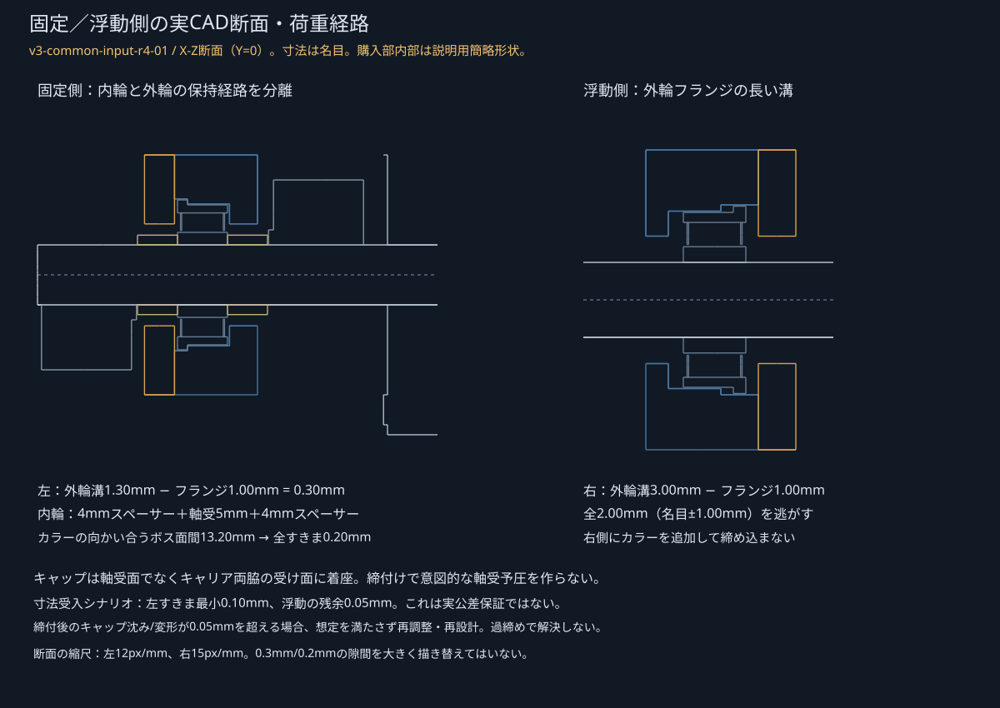

# 共通入力カートリッジ — ホルダー・試験フランジの実CAD

**`v3-common-input-r4-01`。1本の入力部を実CAD化したものです。低抵抗の実証、製造リリース、三案の歩行機の完成ではありません。**

前段の [共通冷風基準の研究](../commercial_basis_r3/DESIGN_GATE_ja.md) は上書きしていません。今回は風車・歯車列・脚の探索を増やさず、既製120mm D軸、軸受2個、金属Dハブ、軸方向保持を1組に限定しました。**軸の切断・穴開け・端面タップは不要**です。


## ファイル

| 内容 | 正本 |
|---|---|
| ネイティブFreeCAD | [CommonInputR4.FCStd](../../../FreeCAD/Ver.3/common_input_r4/CommonInputR4.FCStd) |
| STEP | [CommonInputR4.step](../../../FreeCAD/Ver.3/common_input_r4/CommonInputR4.step) |
| 印刷用STL | [キャリア](../../../STL/Ver.3/common_input_r4/P_CARRIER.stl)、[押さえ×2](../../../STL/Ver.3/common_input_r4/P_CAP.stl)、[試験フランジ](../../../STL/Ver.3/common_input_r4/P_FLANGE.stl)、[フィット試験片](../../../STL/Ver.3/common_input_r4/Q_BEARING_FIT.stl) |
| 組立・部品表 | [組立手順](ASSEMBLY_ja.md)、[BOM.csv](BOM.csv)、[正規配置・手順集合](assembly.json) |
| 寸法・生成 | [input_cartridge.json](../../../scripts/ver3/input_cartridge.json)、[CAD生成](../../../scripts/ver3/build_input_cartridge.py) |
| 接触・経路 | [assembly_access.json](assembly_access.json)、[公差積層](tolerance_stack.json) |
| 質量・費用・数値 | [CAD検査](cad_validation.json)、[調達](procurement.json)、[軸の梁計算](shaft_mechanics.json)、[STL検査](stl_validation.json) |
| 版・出典・ハッシュ | [manifest.json](manifest.json) |

FreeCADは名前・部品ID・仕様・質量根拠を持つ36個のPartフィーチャです。パラメータ変更の正本はJSONと生成スクリプトで、表示用の文字プロパティを書き換えるだけで形状が追従するSketcher履歴ではありません。ネイティブ／STEPは44ソリッドで一致します。購入部の内部は**新規に作成した寸法モデル**で、メーカーの特許形状・B-rep・図面・メッシュをコピーして配布していません。

## 何が具体化したか

| 項目 | この版の結果 | まだ確認していないこと |
|---|---|---|
| キャリア | 支点・キャップ座・軸受フランジ溝・4本の本体取付穴を持つ一体形状 | 実際の造形収縮、同軸度、積層方向の強度 |
| 位置決め | **左の1軸受を2カラーと2スペーサーで挟む**。内輪積層の全すきま0.20mm | 実物の軸受内部すきま・締付後のエンドプレイ |
| 浮動 | 右外輪フランジに全2.00mm、名目±1.00mmの軸方向移動 | はめあい・支持の変形を含む実際の自由移動 |
| トルク伝達 | 6mm D軸→メーカー指定の金属Dハブ→16mm正方形の4本M4→試験フランジ | 締付条件・実伝達トルク・疲労 |
| 脱着 | 両キャップを先に組む、ハブ／フランジを先組み、軸を左から入れる経路を検査 | 指の操作性、すべての工具・誤差条件 |
| 始動抵抗 | 不要な名目接触を幾何で排除。抵抗は独立した感度入力のまま | **実部品の始動／回転抵抗値は未公表・未測定** |

## 固定側・浮動側と過締めによる予圧



配置はX＝軸方向、Y＝左右、Z＝高さ。軸中心Z=30mm、支点中心X=16.5／96.5mm、支点間80mmです。

左の固定側では、外輪フランジの厚さ1.00mmに対して深さ1.30mmの空間を設けます。**3mm厚キャップはキャリア両脇の座へ着座し、軸受の面を締め付ける蓋ではありません。** 内輪側には外径約8mm・長さ4mmの既製鋼スペーサーを前後に置き、カラーの9mm径ボスと薄い蓋の干渉を避けます。正規CADではスペーサーのメーカー参照寸法6.05mm内径／7.95mm外径を用いています。

前の候補段階でカラーを左右の軸端へ1個ずつ配置した案から、**固定側の前後へ2個を集める**構成に変更しました。右軸受にカラーを追加して全体を締め上げる構成ではありません。キャリアの左右距離を、複数の内輪を通じて突っ張らせないためです。

| 名目寸法と受入シナリオ | 値 |
|---|---:|
| 固定側の外輪軸方向遊び | 0.30mm |
| 固定側の内輪＋2スペーサーに対するカラー間の全遊び | 0.20mm |
| 浮動側の外輪フランジの全移動 | 2.00mm |
| 受入仮定の端で残る固定側外輪すきま | 最小0.10mm |
| 受入仮定の端で残る片側浮動余白 | 最小0.05mm |

この計算に使ったポケット誤差±0.10mm、フランジ厚さ誤差±0.05mm、キャップ圧縮予算0.05mm等は、**実部品がその公差で届くという保証ではなく、採用する前に確認すべき設計受入条件**です。実物・材料・締付力がこれを満たさなければ再計算します。キャップが沈み込むほど締める、ガタを消すためカラーを強く押し付ける、きつい軸受をボルトで引き込む方法は取扱条件に含めません。

浮動端での円筒外周の支持長さは名目最小約2mmです。フランジにも径方向の案内がありますが、径のガタ・傾き・保持剛性まで保証したものではありません。試験片と実物の自由な移動を確認し、外輪が傾いて重くなる組合せを合格にしません。ローター荷重、歯車かみ合い、機体への取付けはこのカートリッジを全機へ組み込む次の段階です。

## Dハブは「微小交差＝不適合」でも「拡大して合格」でもない

メーカーの [1309-0016-1006](https://www.gobilda.com/1309-series-sonic-hub-6mm-d-bore/) は、6mm Dシャフトへの装着、2本の締付ねじ、分解時の解放を明示しています。この**メーカー指定の組合せ**を設計上の互換性の根拠にします。

一方、メーカーSTEPのD平面は中心から約2.48mm、軸は約2.50mmで、組付けた参照CADに約0.669mm³の微小交差があります。供給CADが開放状態か締結状態か、数値公差、締付け量の説明は確認できませんでした。**メーカー形状を拡大したり、軸を削ったことにして交差を消していません。** 交差は「メーカー指定の締付界面・状態未確認」として検査の例外表に残し、現物の挿入・締付・トルクの確認と分けます。

ハブの4本の取付穴は中心±8mmの正方形、パイロット14×2mmです。4mm厚の試験フランジ、1mm座金、M4×12によって名目ねじかかり7mm、ハブ裏面まで1mmを残します。ねじ山を省略したCADのねじ接触体積も、干渉なしのすきまばめとは呼びません。

メーカー商品ページのハブ質量14gに対して、リンク先の古い仕様シートには9.6gが記載されています。ボルト込み／本体のみの差なのか、版の差なのかは未確認です。**前報の4品目59gは14gを用いた購入アセンブリの基準値として維持し、軽い9.6gへ都合よく変更しません。**

## 小BOMと質量・費用

全て同じ入力カートリッジに使う部品です。輸入部品を全ての脚・軸へ展開する指示ではありません。クランプねじは購入カラー／ハブのアセンブリに含まれるため別途重複計上しません。

| 部品番号 | 必要数 | 購入単位 | 表示単位価格USD | 根拠 |
|---|---:|---:|---:|---|
| 2101-0006-0120、6mm D軸120mm | 1 | 1本 | 4.69 | [メーカー](https://www.gobilda.com/2101-series-stainless-steel-d-shaft-6mm-diameter-120mm-length/) |
| 1611-0514-0006、フランジ軸受 | 2 | 2個 | 3.99 | [メーカー](https://www.gobilda.com/1611-series-flanged-ball-bearing-6mm-id-x-14mm-od-5mm-thickness-2-pack/) |
| 2910-0919-0006、クランプカラー | 2 | 1個×2 | 4.49/個 | [メーカー](https://www.gobilda.com/2910-series-aluminum-clamping-collar-6mm-id-x-19mm-od-9mm-length/) |
| 1309-0016-1006、金属Dハブ | 1 | 1個 | 7.99 | [メーカー](https://www.gobilda.com/1309-series-sonic-hub-6mm-d-bore/) |
| 1521-0008-0040、4mm鋼スペーサー | 2 | 4個 | 2.49 | [メーカー](https://www.gobilda.com/1521-series-6mm-id-spacer-8mm-od-4mm-length-4-pack/) |
| 2800-0004-0012、M4×12 | 4 | 25本 | 3.59 | [メーカー](https://www.gobilda.com/m4-x-0-7mm-zinc-plated-socket-head-screw-12mm-length/) |
| 2800-0004-0020、M4×20 | 4 | 25本 | 3.99 | [メーカー](https://www.gobilda.com/m4-x-0-7mm-zinc-plated-socket-head-screw-20mm-length-25-pack/) |
| 2801-0004-0008、4×8×1mm座金 | 12 | 25枚 | 1.99 | [メーカー](https://www.gobilda.com/2801-series-zinc-plated-steel-washer-4mm-id-x-8mm-od/) |
| 2812-0004-0007、M4緩み止めナット | 4 | 25個 | 2.99 | [メーカー](https://www.gobilda.com/m4-x-0-7mm-nylock-nut/) |
| 印刷：キャリア／押さえ／フランジ | 1／2／1 | STL数量どおり | 材料価格は仮定 | [BOM](BOM.csv) |

**必要な本体数量でなく、余剰を含む最低購入ロットで $40.70**。仮140／160／180円/USDなら5,698／6,512／7,326円です。日本への送料、輸入税、為替・決済手数料は未確定で別記。基準9月27日の表示価格・購入選択肢は在庫の予約や日本到着日の保証ではありません。

| 質量 | 根拠 | 値 |
|---|---|---:|
| 前報4品目だけの小計 | 購入ページの名目値 | **59.00g** |
| 全購入品 | 上記にスペーサー・全締結品を加算 | **85.28g** |
| 印刷4実体 | 実CAD全ソリッド×仮定PETG密度1.27g/cm³ | **39.70g** |
| カートリッジ合計 | 上記2項の和 | **124.98g** |
| 実測／スライス質量 | 未実施 | **UNKNOWN** |

フィット試験片の組立数量は0で、本体質量に含みません。印刷材料単価2,000～4,000円/kg、サポート等1.2倍を仮定すると本体材料費は約95～191円ですが、実スライス値やフィラメント1巻の購入費ではありません。初回の材料費集計には別途約13gの試験片1枚も含め、`procurement.json` の `firstPrintIncludingCouponAndWasteCostJpy` で本体のみと区別しています。失敗印刷や試験片の再印刷回数は未確定です。**この小BOMを全歩行機の2万円予算達成と読み替えません。** 作業台・機体に固定する4本の取付ねじは相手材の厚さが未定のためこのカートリッジBOMの対象外です。未固定のまま運転してよい意味ではありません。

## 検査したこと

実メーカーSTEPを私的作業領域で読み、公開側の新規寸法モデルとは別に照合しました。配布物にはベンダー形状を含めません。

- 静止630組合せ、15°刻み24姿勢で回転／固定部7,560組合せを確認。ねじ界面と指定D締付界面以外の体積交差は検出しませんでした。
- 回転部対印刷部の標本最小すきまは約1.080mm。さらに全回転体のX位置−0.60／0／+0.15mm、30°刻みも確認しています。
- 左外輪の−0.30～0mm、右外輪の±1mm移動でキャリア／押さえとの体積交差は0でした。
- 前後4mmスペーサーと実メーカー内輪端面の接触面積はそれぞれ約13.91mm²でした。
- 軸受→キャップの順序、軸の左抜き、軸を抜いた後のハブ／フランジ上抜き、停止角を選んだクランプキーの上方経路を記録しています。
- ネイティブ再読込みの36オブジェクト、44ソリッド、STEP体積・配置の一致、4種類STLの閉じた単一実体と230mm以下の外接範囲を確認しました。

これは標本と記載した工具包絡の確認であり、**全連続経路、手指、あらゆる工具、実公差条件の厳密証明ではありません**。軸受の6mm穴やDクランプが実際に軽く通ることは、メーカーの指定と現物の確認が必要です。

## 要求値・抵抗・余裕を混同しない

支点間80mm、2NをX=67mmへ与える軸単体の単純支持梁スクリーニングでは、最大たわみ約0.00183mm、曲げ応力約2.11MPa。12Nmmのねじりでは角変化を約0.000102～0.000144radの剛性上下界として求めました。**D断面のねじり定数を極断面二次モーメントで代用していません。** 荷重・E/GはR3入力周辺を丸めた比較仮定で、実荷重・許容試験荷重・材料証明ではありません。

ここにはホルダー・印刷座・締結部の全体変形を含めていません。メーカーの始動／回転トルク公表値は確認できず、軸受2個で0.2／0.6／2.0Nmmという以前の値は**感度入力のまま**です。購入品を選んだことやCAD上で擦らないことから、実抵抗がその値以下だとは結論しません。

流体の正味トルク代理予測、実部品の抵抗、任意の下流2倍余裕／供給減率0.5は別項目です。このカートリッジの形状確定だけで未校正の流体値を保証値へ変えていません。

## 再生成

FreeCAD 1.1.3の既存バンドルPythonと既存のNumPy/SciPy/trimeshを使用します。メーカー部品は製品ページから個別に取得し、リポジトリ外の私的フォルダーへ `bearing.step / collar.step / shaft.step / hub.step / spacer.step` として用意する仕様です。公開されたダウンロードファイルを再配布するものではありません。

```sh
/Applications/FreeCAD.app/Contents/Resources/bin/python \
  scripts/ver3/build_input_cartridge.py \
  --freecad-lib /Applications/FreeCAD.app/Contents/Resources/lib \
  --vendor-dir /path/to/private-reference
python3 -m unittest discover -s scripts/ver3 -p 'test_input_cartridge.py' -v
python3 scripts/ver3/cartridge_report.py
python3 scripts/ver3/cartridge_report.py --verify
```

上記はデータ生成・検査で、プリンター、ドライヤー、ユーザーのライブCADシーンは操作しません。ネイティブには作成時刻等があるため、再生成時のファイルバイト不一致と幾何不一致を同一視せず、形状・配置・体積・入力ハッシュで照合します。
