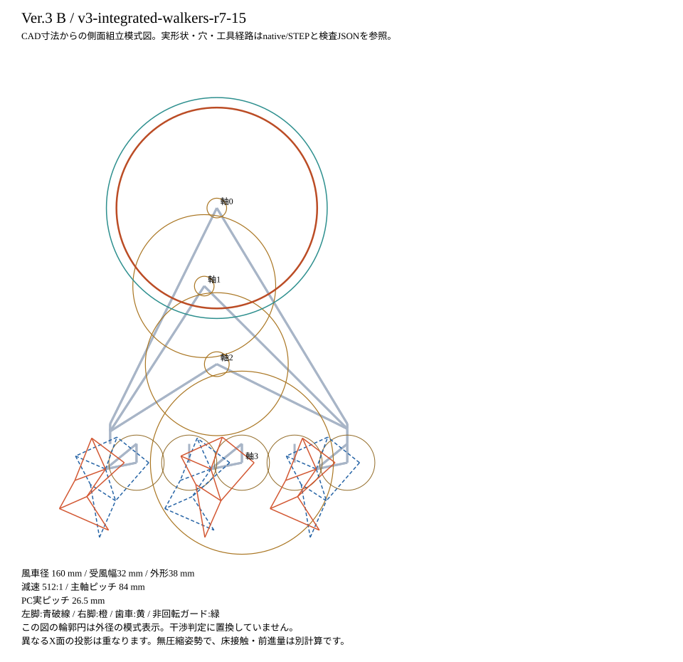

# B：全体モデルの判断資料

版：`v3-integrated-walkers-r7-16-floor2`。**実測始動・30cm歩行は未確認、製作リリースではありません。**
工程・経路の独立レビューとR7-I1是正の状態は[統合レビュー](../REVIEW_ja.md)を参照してください。幾何・性能数値とは別に、工程在庫へ拘束したschema 2の経路検査を使います。

|項目|保存データ|
|---|---|
|方向|小風車・高減速/低速|
|風車／減速|径160mm、受風幅32mm、外形38mm／512:1|
|名目質量|1101.370g。実CADソリッド体積・仮密度・購入品の表示値/明示推定の合計|
|基準姿勢の重心 X,Y,Z|-0.401, -14.629, 132.758mm|
|購入・初回材料|23,735円。送料別|
|国内税の未確定分／任意輸入税準備金|178円／568円。確定税額ではない|
|初回試験片・組立台|118.36g分を費用に含む。歩行質量には含まない|
|承認予算|1台約23,000円、2026-09-28 JSTにユーザー承認（親調整担当から伝達）。送料・未確定税等別|
|native/STEP／静止／有限作動域／段階挿入|PASS／PASS／PASS／PASS|
|実歯形断面／回転包絡スクリーニング|PASS。指定断面のチェックで、連続全角度や製作公差を保証するものではない|
|公差・支持の有限ケース|162/162。入力トルク偶力の両符号とガイド摩擦感度を含む|

## 同じ冷風基準での条件

6.4m/sをGaussianピーク、σ20mmに置く従来の仮定です。特定のPanasonic/ReFaの保証値ではありません。
ガードの実配置で遮られる光線を除外し、圧力回復・ガード後流・回転時の空力は補っていません。
原供給の静止代理・角度サンプル最小は **1.1566mN·m**。
Bの時計回り入力は、鏡映した羽根と軸の上側への同量オフセット照準で符号を合わせています。

冷風速度の参考値は[Scott/Curran, ASEE2025 paper46692, §2.2/Fig.8](https://peer.asee.org/laboratory-fixture-for-heat-transfer-using-a-hair-drier.pdf)の別機種実験です。
[Panasonic EH-NE5L](https://panasonic.jp/hair/products/EH-NE5L.html)はCOLD動作仕様の参考であり、この実測流速を保証していません。
メーカー指定用途外の機器操作を勧めたり、許可したものではありません。

|抵抗感度|入力要求 mN·m|独立min/max包絡差 mN·m|到達位相の最小差 mN·m|原供給×0.5との差 mN·m|
|---|---:|---:|---:|---:|
|low|0.4012|+0.7554|+0.7554|+0.1771|
|nominal|0.9422|+0.2144|+0.2144|-0.3639|
|high|2.8909|-1.7343|-1.7343|-2.3126|

独立包絡は供給の全角最小と要求の全角最大、到達位相差は実減速比・組付け位相を保った対応角での差です。
両者は同じ意味ではなく、包絡を緩めて物理合格にしたものではありません。
low/nominal/highは、軸受1個あたり0.1/0.3/1.0mN·m、摺動摩擦係数0.05/0.10/0.18、
1噛合い効率0.95/0.90/0.80の未測定感度です。実部品の低抵抗が証明された値ではありません。

名目条件の床滑り仕事 50.053、案内摩擦 11.497、
脚ジャーナル 39.788Nmm/クランク1回転。
往復移動を相殺していません。ばねの蓄積・回収は位置エネルギーに一度だけ含みます。
負荷中の最大滑り推定 23.19mmで、旧3mm目標は別判定のままです。

下流条件を名目のまま固定した場合、入力軸受2個の合計抵抗が満たすべき上限は
**0.8144mN·m**。実部品がこの値以下とは未確認です。
規定RPMは達成値ではありません。速度の対応・慣性・仕事残差は[work_budget.json](work_budget.json)に保存しています。
仮に入力120RPMを維持できれば、30cmに13.83分相当です。

### 不利条件を原代理の合格と混ぜない

|共通送風感度（仮定）|名目抵抗での最小差 mN·m|
|---|---:|
|風速5.12m/s（基準の80%）|-0.2014|
|風速7.68m/s（基準の120%）|+0.7225|
|噴流σ15mm|-0.1654|
|噴流σ25mm|+0.5416|
|照準10mm内側|+0.0604|
|照準10mm外側|+0.2921|

|風車の静的偏心仮定 mm|不利な偏心向きでの最小差 mN·m|
|---:|---:|
|0.00|+0.2144|
|0.05|+0.1702|
|0.10|+0.1260|
|0.25|-0.0065|

送風速度±20%、噴流σ15/25mm、照準の内外10mmは感度入力で、機器の保証範囲や信頼区間ではありません。
各送風条件では支持力・重心/接触・負荷も再計算しています。偏心は静止重力トルクの不利方向包絡であり、遠心力や運転中のバランス検証ではありません。
原供給×0.5、下流要求×2、実測下限UNKNOWNは別判定です。[全感度データ](environment_sensitivity.json)

## 組付け固有値

主軸は5mm-AF、ピッチ84mm、同期歯車42歯。
入力6D軸140mmは切断・端面タップ不要。下流の国内六角材は100mmと58mmへ切断・端面処理します。
カラーの追加クロック角は H_INPUT_COLLAR_001: -64.29°、H_INPUT_COLLAR_002: +154.29°。
これは名目形状の静的1面バランスであり、購入品の実重心・印刷偏心・動釣合いの認定ではありません。
左右/前後の当たり面と組立順は[共通組立手順](../ASSEMBLY_ja.md)を参照してください。

## 一式

- [native](../../../../FreeCAD/Ver.3/integrated_r7/B/Walker_B.FCStd)／[STEP](../../../../FreeCAD/Ver.3/integrated_r7/B/Walker_B.step)
- [印刷STL](../../../../STL/Ver.3/integrated_r7/B/)／[部品表](BOM.csv)／[最低購入lot](purchase_lots.json)
- [全インスタンス・正規パラメータ](assembly.json)／[静止交差](static_collisions.json)／[作動域](gait_motion.json)／[挿入経路](assembly_access.json)
- [接地・公差](contact_sensitivity.json)／[局部構造・軸梁](structure.json)／[供給・要求](work_budget.json)／[回転断面](rotating_clearance.json)
- [STL姿勢・実寸PET型紙](print_geometry.json)／[機械可読の組立工程](assembly_stages.json)
- [全非接地部と床](floor_clearance.json)／[native包含包絡](floor_envelopes.json)／[市販DN-03の全工具アクセス](rocker_pin_access.json)
- [床是正と未確認範囲](../FLOOR_CORRECTION_ja.md)／[代表5点の実層](../SLICING_ja.md)

材料の異方性、固定部とフレーム接合の変形、実際の工具寸法・印刷はめあい、実風・実抵抗は別の確認が必要です。
部品が存在し、有限CAD検査を通ることと、実機運転の合格は分けて扱います。

### 最後の回転確認による限定是正

18歯ピニオンとM3ナットの「角」に、静止姿勢では出ない名目接触が見つかりました。
保持ねじの半ピッチ13→14mmを、キャップ・フレーム・穴・締結品・PET型紙へ共通値から反映しました。
歯形や判定閾値は変更していません。名目の最小径方向隙間は0.9746mm、キャップの穴縁肉厚2.75mm、支持ボス3.25mmです。
要求工具の先端外幅7.6mm・厚さ1.8mmの空間を確認しましたが、市販工具の型番・実外形・手元への適合は未確認です。
これを実公差込みの保証にはしていません。[是正根拠](retainer_corner_correction.json)／[要求工具の確認](retainer_tool_access.json)

## この版の実相手歯車対

|段|モジュール mm|圧力角 度|歯数（入力／出力）|転位（入力／出力）|
|---|---:|---:|---:|---:|
|1|1|25|14/112|+0/-0|
|2|1|25|14/112|+0/-0|
|3|1|25|18/144|+0/-0|
