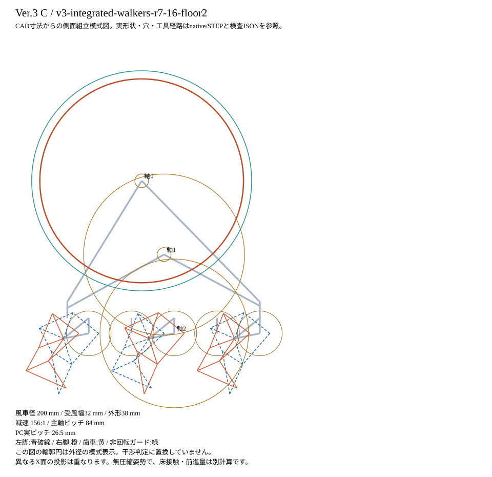

# C: whole-machine design assessment

[日本語 (original)](README_ja.md) | **English** | [Document languages](../../../README_en.md)

> Presentation-only translation of the unchanged Japanese source. Source SHA256: `7eb9f08eb92270fd35069ed75b254d6dbb86195eaf532cf8ab28464153e4197f`. Numbers, part IDs, equations, code and qualification limits are retained; this is not a new engineering revision.

Revision: `v3-integrated-walkers-r7-16-floor2`. **Physical starting/30 cm walking unverified; not a manufacturing release.**
See [integration review](../REVIEW_en.md) for independent stage/path review and R7-I1 correction status. Separate from geometry/performance numbers, schema 2 checks bind paths to stage inventory.

|Item|Stored data|
|---|---|
|Concept direction|Intermediate diameter, lightweight frame|
|Rotor / reduction|Diameter 200 mm, capture width 32 mm, axial envelope 38 mm / 156:1|
|Nominal mass|1031.433 g: actual CAD solid volumes × assumed densities plus listed/explicitly estimated purchased-part mass|
|Reference-pose center of mass X,Y,Z|2.732, -17.103, 115.691mm|
|Purchases and initial material|JPY 23,154, excluding shipping|
|Separate costs|Shipping, unresolved taxes and unowned tools such as DN-03, about JPY 396. Separate from shared-purchase averages|
|Unresolved domestic tax / optional import-tax reserve|JPY 178 / JPY 568; not confirmed tax amounts|
|Initial coupons and assembly stand|118.36 g counted toward cost, not walking mass|
|Approved budget|About JPY 24,000 per 1 machine, approved 2026-09-28 JST by the user (relayed by parent coordinator). Shipping/unresolved taxes separate|
|Native/STEP / static / finite motion / staged insertion|PASS／PASS／PASS／PASS|
|Actual tooth-section / rotational-envelope screening|PASS for specified sections, not guaranteed continuous-angle clearance or fabrication tolerances|
|Finite tolerance/support cases|162/162, including both input-torque-couple signs and guide-friction sensitivity|

## Conditions under the same cold-air reference

Existing assumption: 6.4 m/s Gaussian peak, σ=20 mm. Not a guaranteed Panasonic/ReFa value.
Rays blocked by actual guards are excluded; pressure recovery, guard wakes and rotating aerodynamics are not modeled.
Minimum sampled stationary raw-supply proxy: **1.4629 mN·m**.
B's clockwise input uses mirrored vanes and the same offset aim above the axis to match the sign.

Cold-air velocity reference: another dryer's experiment in [Scott/Curran, ASEE2025 paper46692, §2.2/Fig.8](https://peer.asee.org/laboratory-fixture-for-heat-transfer-using-a-hair-drier.pdf).
[Panasonic EH-NE5L](https://panasonic.jp/hair/products/EH-NE5L.html) references COLD operating specifications, not a guarantee of that measured velocity.
This neither recommends nor authorizes appliance operation outside its specified use.

|Resistance sensitivity|Input demand, mN·m|Independent min/max envelope margin, mN·m|Minimum reached-phase margin, mN·m|Margin with raw supply ×0.5, mN·m|
|---|---:|---:|---:|---:|
|low|0.7163|+0.7467|+0.7468|+0.0153|
|nominal|1.3463|+0.1166|+0.1168|-0.6147|
|high|3.5359|-2.0729|-2.0725|-2.8040|

Independent envelope combines all-angle minimum supply/maximum demand. Reached-phase margin uses corresponding angles preserving actual reduction and installed phase.
These differ in meaning; the envelope is not relaxed to claim physical qualification.
low/nominal/high are unmeasured sensitivities: 0.1/0.3/1.0 mN·m per 1 bearing, sliding coefficients 0.05/0.10/0.18,
and 1-mesh efficiencies 0.95/0.90/0.80. Not demonstrated low physical resistance.

Nominal floor-slip work 44.337, guide friction 10.142,
leg-journal work 37.880 Nmm per 1 crank revolution.
Back-and-forth travel is not canceled. Spring storage/recovery enters potential energy only once.
Estimated maximum loaded-episode slip 21.77 mm; old 3 mm target remains a separate judgment.

With downstream conditions fixed nominally, total resistance of 2 input bearings must not exceed
**0.7168 mN·m**. Actual parts meeting that bound are unverified.
Prescribed RPM is not achieved RPM. Speed relationships, inertia and work residuals are in [work_budget.json](work_budget.json).
If 120 input RPM could be maintained, 30 cm corresponds to 4.22 minutes.

### Keep adverse cases separate from raw-proxy passes

|Common airflow sensitivity (assumed)|Minimum nominal-resistance margin, mN·m|
|---|---:|
|Airspeed 5.12 m/s (80% of reference)|-0.4064|
|Airspeed 7.68 m/s (120% of reference)|+0.7564|
|Jet σ=15 mm|-0.3742|
|Jet σ=25 mm|+0.5695|
|Aim 10 mm inward|-0.0430|
|Aim 10 mm outward|+0.2326|

|Assumed static rotor eccentricity, mm|Minimum adverse-eccentricity margin, mN·m|
|---:|---:|
|0.00|+0.1168|
|0.05|+0.0590|
|0.10|+0.0012|
|0.25|-0.1722|

Airspeed ±20%, jet σ=15/25 mm and inward/outward aim 10 mm are sensitivity inputs, not appliance guarantees or confidence intervals.
Support, center-of-mass/contact and loads are recalculated for each airflow condition. Eccentricity is an adverse static-gravity-torque envelope, not centrifugal-force or running-balance verification.
Raw supply ×0.5, downstream demand ×2 and UNKNOWN measured lower bound are separate judgments. [All sensitivities](environment_sensitivity.json)

## Design-specific assembly values

Main shafts: 5 mm AF, 84 mm pitch, 42-tooth synchronization gears.
The 6D input shaft (140 mm) needs no cutting/end tapping. Cut and finish domestic downstream hex stock to 100/58 mm.
Additional collar clocking: H_INPUT_COLLAR_001: -64.29°; H_INPUT_COLLAR_002: +154.29°.
Nominal static 1-plane balance, not qualification of purchased-part centers of mass, print eccentricity or dynamic balance.
See [common assembly](../ASSEMBLY_en.md) for left/right/front/rear contact surfaces and sequence.

## Complete file set

- [native](../../../../FreeCAD/Ver.3/integrated_r7/C/Walker_C.FCStd)／[STEP](../../../../FreeCAD/Ver.3/integrated_r7/C/Walker_C.step)
- [Printable STL](../../../../STL/Ver.3/integrated_r7/C) / [BOM](BOM.csv) / [minimum purchase lots](purchase_lots.json)
- [All instances/canonical parameters](assembly.json) / [static overlap](static_collisions.json) / [motion envelope](gait_motion.json) / [insertion paths](assembly_access.json)
- [Contact/tolerances](contact_sensitivity.json) / [local structure/shaft beams](structure.json) / [supply/demand](work_budget.json) / [rotating sections](rotating_clearance.json)
- [STL orientation/full-size PET templates](print_geometry.json) / [machine-readable stages](assembly_stages.json)
- [All noncontact parts/floor](floor_clearance.json) / [native enclosing envelopes](floor_envelopes.json) / [full commercial DN-03 tool access](rocker_pin_access.json)
- [Floor correction/unverified scope](../FLOOR_CORRECTION_en.md) / [5 representative slices](../SLICING_en.md)

Material anisotropy, fixed/frame-joint deformation, actual tool envelopes, print fits, real airflow and resistance require separate checks.
Part existence and finite CAD passes are distinct from physical operating qualification.

## Actual mating gear pairs in this revision

|Stage|Module, mm|Pressure angle, degrees|Teeth (input/output)|Profile shift (input/output)|
|---|---:|---:|---:|---:|
|1|0.9|20|12/156|+0.35/-0.35|
|2|1|25|12/144|+0/+0|

Do not mix C pair 1 with old C/A/B. Also read [C's 2 additional mating-part slices and supported-face warning](SLICING_en.md).
