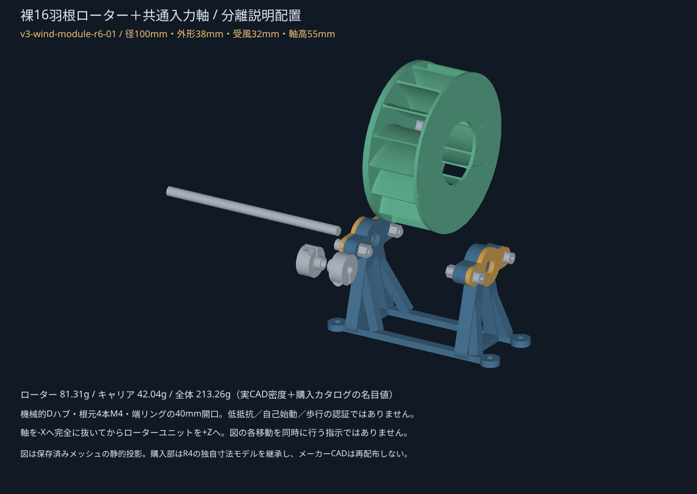

# 1モジュールの組立・脱着・基台条件

**版 `v3-wind-module-r6-01`。CADで確認した組立順です。実組立・動力運転・安全速度の確認はしていません。**

座標はXが軸方向、Yが左右、Zが上。全インスタンスの配置・数量は [assembly.json](assembly.json)、購入lotと個数は [BOM.csv](BOM.csv) が正本です。r4の試験フランジは使わず、ローターの根元板へ置き換えます。軸・軸受・Dハブ・カラーは同じ製品で、軸の切断・穴開け・端面タップは不要です。

## 部品と印刷

- `P_CARRIER`×1：高さ55mm軸用の一体キャリア。斜材4本も一体です。
- `P_ROTOR`×1：根元板4mm・羽根域32mm・端リング2mm、外形38mm。裸16羽根の単一ソリッドです。
- `P_CAP`×2：r4と同じ外輪押さえ。右側を締めて浮動を失わせないでください。
- `Q_BEARING_FIT`：本体数量0。r4のフィット試験片をそのまま再利用できます。

STLはmm・100%。キャリアはレール底面、ローターは根元板、押さえと試験片は平面をベッドへ向けています。ローター端リングの羽根間ブリッジ、根元パイロット座、横向き軸受穴は、サポートや造形補正を含めてスライサーで確認する必要があります。未スライスのため、サポート不要・任意プリンターでの造形成功を主張しません。

## 基台の4穴を先に扱う

取付穴はM4用4.5mm、X=6／114mm・Y=±18mm、**108×36mmパターン**です。キャップ・回転部が無い段階で、上から外径8mmの工具包絡が入ることを確認しています。組立後は左側のキャップねじなどが上方工具を遮る箇所があるので、最後に基台固定を済ませられると仮定しません。

**相手材、厚さ、裏打ち剛性、固定ねじ長さ、固定方法は未確定です。** このBOMに外部固定部を含めた運転可能な架台が揃っているわけではありません。構造計算の根元固定は、実際の相手材・締結が満たす必要のある境界条件です。未固定の模型や、手で持って支えた状態での動力運転を許可する資料ではありません。

## 手順

1. **フィットと基台条件を確認する。** 試験片で購入軸受と造形穴の相性を確認します。きつい穴を締結の力で引き込まないでください。取付方法を決めるまでは動力確認へ進めません。
2. **左の固定側を先に組む。** 軸受フランジを左へ向け、軸受→押さえの順です。M4×20×2本、頭／ナット側の各座金、緩み止めナットを使用します。内輪を締める蓋ではなく、キャリアの受け面へ着座する押さえです。
3. **右の浮動側を組む。** フランジを右へ向け、長い溝に軸方向移動を残します。押さえのねじは回転部を入れる前に締結します。右側に追加カラーを置いて左右軸受を締め上げません。
4. **Dハブとローターを外で先組みする。** 根元の14.3×2.15mm座に14×2mmパイロットを向け、16mm正方形の4穴を合わせます。M4×12と1mm座金を各4個使用し、名目ねじかかり7mmを取ります。ハブのクランプねじ2本と、ローターを留める外部4本は別です。
5. **固定側の2スペーサー・2カラーと軸を配置する。** r4と同じく、左軸受の前後に4mm鋼スペーサーを置き、2カラーで位置決めします。クランプを解放し、支持したローターユニットとD平面を合わせて軸を左から通します。メーカー指定のD組合せですが、きつい場合に削ったり無理に押したりしません。
6. **位置とすきまを合わせる。** ローター根元X=43mm、端リング終端X=81mm、軸高55mmです。固定側の内輪積層は全遊び0.20mmが名目、外輪の遊び0.30mmと右外輪の全2mm移動は別です。キャップの沈み・変形、軸受内部すきま、左右差を無視し、締付けでガタを消すことはしません。
7. **工具・保持を停止状態で確認する。** ローター根元4本へは40mmの端リング開口を通して3mm六角キーを入れます。計算では4mm径のキー包絡、約35.7mmの軸方向部分と上向き65mmハンドルが右支持の手前を通ることを確認しました。実際の曲げ半径・手指・工具長が同じとは限りません。ハブ／カラーのクランプキーも停止角を選んだ上方経路を別に確認します。
8. **ここで動力投入はしない。** 実基台固定、実はめあい・締付け、抵抗・バランス、防護・材料が未確認です。CADの回転包絡が空いていることからドライヤー駆動や600rpmの安全性を承認してはいません。

## 脱着

無動力・完全停止・支持状態で、ハブとカラーのクランプを解放します。軸を完全に左へ抜いてから、ハブとローターの一体ユニットを上へ取り出します。羽根をつかんで曲げたり、端リングに紐を巻いて引いたりしません。32mm金属ハブを6mm軸受穴へ通す経路でもありません。

図は軸を左へ124mm、ローターユニットを上へ70mmなど離した説明配置で、一斉移動の指示ではありません。キャップを外す場合は回転部を先に退避し、ナット工具の空間を戻してください。基台固定の取外しも、最初の締結へ工具を戻せる状態にしてからです。

## 検査の範囲

全径100mm×幅38mmの円筒包絡で固定部との関係を確認しています。実羽根の厚さとテーパーは包絡内で、端リング中央20mm半径の空間と根元の実4穴は別に検査しています。ねじとDクランプ界面は、メーカーの締結を表す界面として記録し、微小な参照CAD交差を数値上消していません。

工具／挿入の経路は [assembly_access.json](assembly_access.json) の部分組立状態と標本が対象です。全手指、連続全公差、任意工具の操作性を証明するものではありません。外部基台の固定が未確定であることも、同ファイルとnative付随資料に保持しています。
