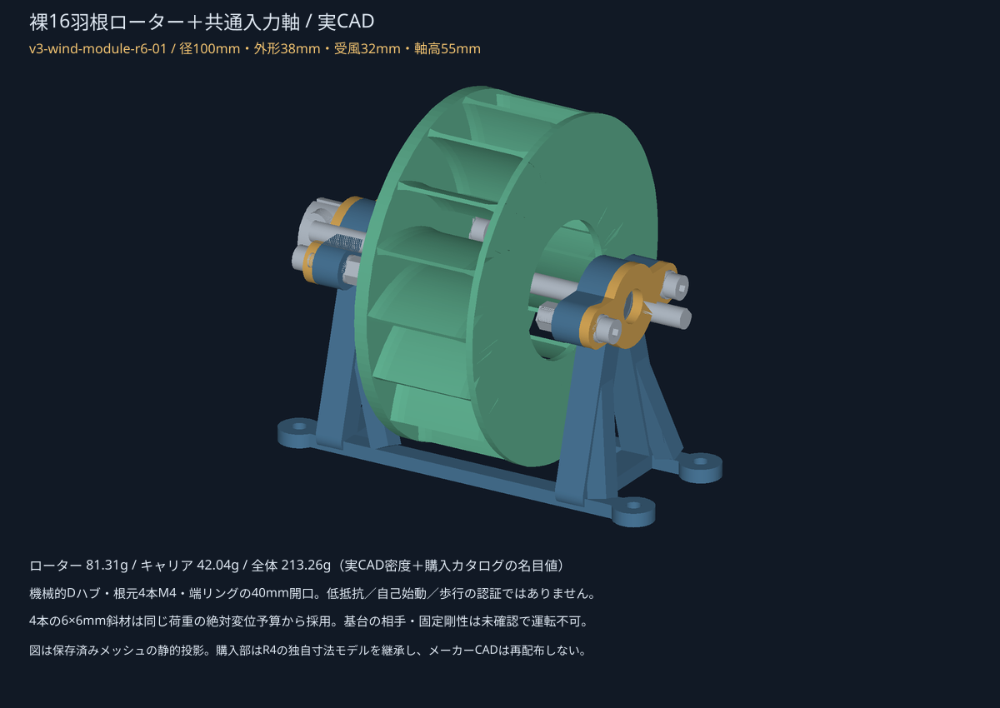
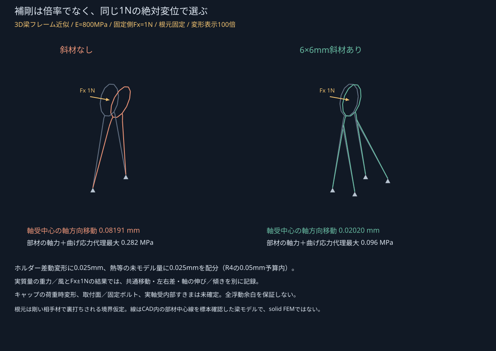
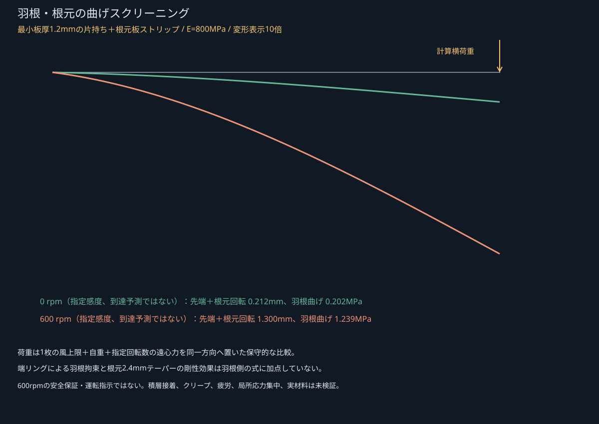

# 裸16羽根＋入力軸の基準モジュール

**`v3-wind-module-r6-01`。径100mmの1モジュールを実CAD化しました。C歩行機の完成、自己始動・低抵抗の実証、製造リリースではありません。**

外形幅38mmと、根元板・端リングの間の**受風幅32mm**を区別します。軸高55mm、既製120mm・6mm D軸、同じ購入軸受・ハブ・カラーを使用します。r4の試験フランジを一体ローターへ、キャリアを高さ・補剛の派生品へ置き換えています。r4/r5は保存し、別候補群や全機動画は追加していません。



## 配布物

| 内容 | ファイル |
|---|---|
| FreeCAD／STEP | [WindModuleR6.FCStd](../../../FreeCAD/Ver.3/wind_module_r6/WindModuleR6.FCStd) / [STEP](../../../FreeCAD/Ver.3/wind_module_r6/WindModuleR6.step) |
| 印刷STL | [キャリア](../../../STL/Ver.3/wind_module_r6/P_CARRIER.stl)、[ローター](../../../STL/Ver.3/wind_module_r6/P_ROTOR.stl)、[押さえ×2](../../../STL/Ver.3/wind_module_r6/P_CAP.stl)、[数量0の試験片](../../../STL/Ver.3/wind_module_r6/Q_BEARING_FIT.stl) |
| 組立・部品 | [手順](ASSEMBLY_ja.md)、[BOM](BOM.csv)、[正規配置・段階集合](assembly.json)、[挿入／工具経路](assembly_access.json) |
| 形状・版 | [入力JSON](../../../scripts/ver3/wind_module.json)、[ネイティブ検査](cad_validation.json)、[STL検査](stl_validation.json)、[manifest](manifest.json) |
| 材料・構造 | [補剛比較](holder_sizing.json)、[実質量支持・差動・傾き](actual_mass_support.json)、[羽根／根元／端リング](rotor_strength_screens.json) |
| 風・回転力 | [風荷重](wind_loads.json)、[角度別生代理値](rotor_torque.csv)、[裸／下流接続条件](supply_required.json) |
| 費用 | [調達と材料費の条件表](procurement.json) |

ネイティブは36オブジェクト、44ソリッドです。購入部は自作したr4の寸法モデルを継承し、実メーカーB-repは私的な接触検査だけに使っています。メーカーCAD・図面画像を配布物へ入れていません。形状変更の正本はJSONとスクリプトで、Sketcherの対話履歴ではありません。

## 形状とトルク結合

根元板4mm、受風域32mm、端リング2mmで外形38mmです。16枚の羽根は曲がり角20°。中心線の外半径を49.2mmとし、**壁の厚さまで含めて**端リング・根元板の外径100mmに収めています。根元近くは厚さ2.4mmから1.6mmを経て薄部1.2mmへ、反対端も2.4mmへ変化する平面テーパーです。

ローターは根元・羽根・端リングが一つの閉じたソリッドです。端リングの40mm開口から根元の4本のM4へ工具を通す構成にして、回転後に取り付ける小ねじや接着を主トルク経路に使いません。根元の14.3mm・深さ2.15mmのパイロット座、16mm正方形の4穴は金属Dハブと同じ基準です。M4×12＋1mm座金により名目ねじかかり7mm、ハブ裏面まで1mmを残します。

メーカーの6mm D軸／ハブ対応指定を使いますが、参照CADのD平面2.48mm対軸2.50mmの微小交差は、開放／締結状態や数値公差が不明として別扱いです。拡大・切削したことにして合格化していません。現物の締付け・滑りトルクは未確認です。

軸受・軸・内輪の保持間隔はr4を継承。左固定側を2カラーと2鋼スペーサーで保持し、右外輪の名目±1mm浮動を残します。ローター外形の包絡は右固定部まで3mm、取付基準面まで5mm。軸方向受入位置の端も別に検査しています。**基台の相手材・固定ボルト・裏打ち剛性は未確定なので、運転可能とはしていません。**

## 補剛は絶対値から選定



r5の「同断面なら9.75倍」という比だけで部材を厚くしていません。同じ荷重・方向で、斜材なしと**6×6mmの斜材4本**だけを比較しました。主脚は8mm幅のままです。

| E=800MPaの同一条件 | 斜材なし | 採用斜材あり |
|---|---:|---:|
| 固定側Fx=1N：軸受中心の軸方向移動 | 0.08191mm | 0.02020mm |
| 同条件の部材軸力＋曲げ応力代理最大 | 0.282MPa | 0.096MPa |
| 同じ2N横荷重：左右軸受中心の差動横変位 | 0.00395mm | 0.00372mm |

計算は、実際の中心線・断面から作った3D Euler–Bernoulli梁フレーム近似です。リング・脚・斜材の中心線が実CAD材料内にあることを200点で照合しています。ソリッドFEMや積層樹脂の局所接着解析ではありません。軸受荷重は材料内のリング節点へ等価配分し、実際の玉・軌道の局所接触分布は解いていません。

E=800/1700/2600MPa、ポアソン比0.35、応力スクリーニング8MPaは設計仮定です。根元は剛い相手材で裏打ちされる境界条件で、実基台やボルトの柔らかさを解析済みとはしていません。梁計算器は既知の片持ち梁の各方向荷重・ねじり、座標回転、分割数、反力／モーメント平衡で照合します。

### 共通移動・差動・傾き・浮動余白を分離

実CAD質量の重力、風荷重の包絡、固定側Fx=−1/0/+1Nを重ねたケースでは、最大の**個別軸受中心の軸方向移動**は約0.02298mm。一方、浮動側に必要な長さの変化を表す**左右の差動＋軸の伸びの上界**は最大約0.02302mmです。共通モードの移動を差動の消費量へ加算していません。

FRAMEの材料リング面はX=17.85／95.50mm、軸受荷重点はX=16.50／96.50mmで一致しません。リング面の平均並進・平均回転を別々に保存し、**回転と軸方向オフセットの外積を加えて、実軸受荷重点へ変位を移送**します。この評価点で左右差・支持線傾斜を統一し、節点力／偏心モーメントの仕事と、荷重点の力／変位の仕事の一致を検査しています。これは[独立レビュー](REVIEW_ja.md)で指摘された初稿の評価点欠落を修正したものです。

| 診断 | 結果／扱い |
|---|---|
| ホルダー差動に割り当てる軸方向予算 | 0.025mm |
| 熱等の未モデル量へ残す予算 | 0.025mm |
| R4の元のホルダー／熱の合計予算 | 0.05mm |
| 軸弾性を含む差動の上界 | 約0.02302mm |
| 軸のたわみを加算した横方向相対ずれ上界 | 約0.00398mm |
| 支持の並進・回転と軸の曲げを合わせた相対傾き診断最大 | 約0.00115rad |
| 部分公差積層に残る片側浮動余白 | 最小約0.05198mm |
| **全組立の浮動余白の判定** | **UNKNOWN** |

0.05198mmは「実機でも十分に残る」と確認した値ではありません。ポケット・フランジ・カラー間隔・支持間隔の**設計受入範囲**に、今回計算した差動と熱予算を組み合わせた**部分計算**です。荷重時のキャップ曲げ・接合面の離れ／沈み、実軸受内部すきま、相手材・固定ボルト、実印刷・購入公差は未確定です。軸受メーカーの許容ミスアライメント値も未確認で、上の傾きを適合済みにしません。詳細は `actual_mass_support.json` の共通／差動・傾き・未算定項目を参照してください。

## 羽根・根元・端リング



1枚の羽根に、採用したC_D=1.2とピーク動圧による幾何的な風荷重上界、自重、指定回転数の遠心力を同方向へ置くスクリーニングを行います。ピーク風を全面へ使う操作は**1枚の強度側の仮定**だけで、全ローターの供給電力へは使いません。

薄部1.2mmを全長32mmの片持ちとして扱い、根元2.4mmテーパーと端リングによる拘束の剛性効果を羽根側へ加点しません。根元は6mm幅の分担板ストリップ、端リングは隣接羽根間を単純支持とする別の近似です。実際のボルト／板接触や局所応力集中をソリッドで解いたものではありません。

E=800MPa・600rpmの**指定感度ケース**では、羽根先端＋根元回転の変位代理が最大約1.30mm、羽根曲げ応力代理は約1.24MPaです。無変形の隣接羽根間隔は約6.415mm。互いに逆向きに変形する上界を引く部分比較も保存します。根元板の軸方向曲げ、端リングの1N点荷重、フレーム差動・傾きによる軸方向クリアランス消費は別項目です。

**600rpmは予測回転数でも安全速度でもありません。** 空力は静止モデルであり、回転中の相対流れや回転速度を解いていません。積層接着・クリープ・疲労・実材料・実アンバランスは未検証です。ローターのCAD体積から求めた慣性モーメントは約`1.0894e-4 kg·m²`で、加速時には別途慣性トルクが必要です。

## 実CAD質量を入れた風荷重・回転力の条件表

風条件はr3と同じ、冷風・距離150mm・局所報告値6.4m/sをGaussianピークに置いた設計仮定、σ20mmです。メーカー機種の実測速度分布ではありません。今回の生代理値は、正規33分割中心線の半径49.2mmと受風幅32mmを使っています。壁厚テーパー・端リングの流れ・圧力回復・回転中性能はモデル化していません。

端板・購入回転部の包絡と固定部のCAD投影面へ同じ動圧を積分し、支持の追加荷重を見積もりました。回転部追加約0.00567N、固定部約0.00173Nの横力です。遮蔽を二重に数える可能性を含む**採用係数内の保守的荷重代理**であり、物理的な係数上限ではありません。これらを新たな供給トルクとして加点していません。

| 同一基準の診断 | 条件 | 結果 |
|---|---|---:|
| 生の静止ロータートルク代理・全角最小 | 未校正、減率なし | 約0.8127mN·m |
| 裸モジュールの入力軸受2個 | 名目抵抗仮定、理想バランス | 0.6000mN·m |
| 裸モジュールの生代理との差 | 同じ理想バランス条件 | 約+0.2127mN·m |
| 裸モジュールの減率0.5後との差 | 減率も未校正の設計入力 | 約−0.1937mN·m |
| 回転系全体の重心偏心0.1mm | 購入回転部も含む144.75g名目 | 生代理との差最小約+0.0723mN·m |
| 回転系全体の重心偏心0.5mm | 同じ抵抗仮定 | 生代理との差最小約−0.4923mN·m |
| Cの下流を仮に接続 | 下流入力軸換算 | 約0.7097mN·m |
| 同じC条件の総要求 | 入力軸受0.6を一回加算 | 約1.3097mN·m |
| C接続時・減率なし／余裕なしの位相対応差 | input角=25×crank角 | 最小約−0.4969mN·m |
| **実自己始動／実歩行** | 未測定 | **UNKNOWN** |

ローターの幾何学的重心は軸上ですが、実際の回転系バランスを保証しません。偏心感度は印刷ローターだけでなく購入ハブ・カラー・軸を含む回転系へ適用しています。

下流接続行は、未CADのr3脚／減速／重心目標・摩擦仮定を保持した条件計算です。旧入力＋ローターを一回取り除き、本モジュール213.26gを一回だけ入れ、C全機の名目質量仮定を約0.52487kgとして計算しています。新しい下流CADや噛合い、接地動力学を完成させたわけではありません。

下流の設計余裕2倍を使う場合も、**入力軸受後の下流要求にだけ倍率を掛け、入力軸受を一回戻す**定義です。総要求の単純2倍や、測った出力からの二重損失控除にはしません。裸0.8127と仮軸受0.6の大小から、脚・歯車を駆動できるとは結論していません。

## 質量・小BOM・費用

| 項目 | この版の名目値 |
|---|---:|
| 一体ローター：実CAD全ソリッド×仮定密度 | 81.31g |
| 補剛キャリア：同上 | 42.04g |
| 押さえ2個を含む印刷合計 | 127.98g |
| 購入部カタログ合計（r4と同じ） | 85.28g |
| **モジュール合計** | **213.26g** |
| 最低購入ロット | **$40.70** |
| 仮160円/USD＋仮3,000円/kg、試験片・サポート1.2倍込み | **約7,019円** |

実測／スライス値ではありません。r4の124.98gにローターをそのまま足してはいません。旧試験フランジと旧キャリアを除き、新形状へ置き換えた合計です。メーカーのハブ質量14gと古い仕様シート9.6gの不一致は残し、軽い方へ変更していません。

入力の金属部・ねじ・座金の購入lotは一回だけです。端リングを留める追加ねじはありません。送料・税・決済費、基台の相手材／取付ボルトは別。約2万円との差が約1.3万円あることは、未完成の下流BOMがその額に収まる証明ではありません。

## 三案の主課題へ戻るための残り

1. **入力の実抵抗・回転中供給の境界を閉じる。** 形状・質量・静的モデルと、未測定のグリース抵抗、組立バランス、空力を分離する。近いRe・縦横比・局所噴流で使えるデータがなければ、未校正モデルの反復だけで合格させない。
2. **下流の実体と公差に強い脚・同期機構を完成させる。** r3の脚は名目改善があっても±0.1mm時に足上げ・切替目標が未達。実在する国内下流部品、反力・重心・組付け・干渉・基台を同じ実CADへ統合する。本モジュールだけでA/B/Cの最終構造が確定したとはしない。
3. **同じ実BOM・入力条件で三案を再判定する。** A大径少段／B小径高減速／C中間軽量を維持し、共有購入lot・全材料費、全位相の静的／動的要求と供給、保持・支持、約30cmの実確認を揃える。現時点の合格歩行機は0案。

## 再現・検証

```sh
python3 -m unittest discover -s scripts/ver3 -p 'test_*.py' -v
/Applications/FreeCAD.app/Contents/Resources/bin/python scripts/ver3/build_wind_module.py \
  --freecad-lib /Applications/FreeCAD.app/Contents/Resources/lib \
  --vendor-dir /path/to/private-reference
python3 scripts/ver3/analyze_wind_module.py
python3 scripts/ver3/report_wind_module.py
python3 scripts/ver3/report_wind_module.py --verify
```

購入、印刷、家電操作、新しい大型ソフト導入は行っていません。別コンテキストのレビュアー1名による限定した機械・モデルレビューで、評価点の変位移送に1件の重要な修正を行いました。[是正記録](REVIEW_ja.md)には、初回レビューと、ユーザーが追加許可した**別の独立レビュアーによるR6-1限定是正確認**を区別して保存しています。同一レビュアーの追認や、全機の再承認ではありません。独立レビューは人間の有資格者による製造・運転承認でもありません。
